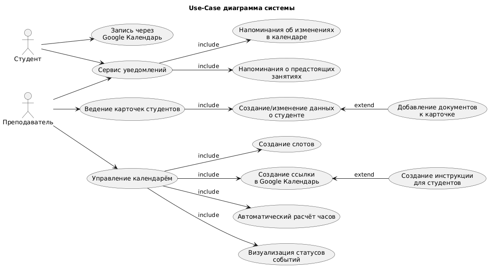

# **Лабораторная работа №1**

**Тема:** Формулирование требований к программной системе  
**Цель работы:** Научиться анализировать поставленную задачу, формулировать функциональные и нефункциональные требования к проектируемой системе.

---
## **Перечень заинтересованных лиц (стейкхолдеров)**

### **Основные стейкхолдеры:**
1. **Преподаватель (Основной пользователь)**  
   - *Роль:* Ключевой пользователь и администратор системы  
   - *Интересы:* Эффективное планирование консультаций, централизованное хранение студенческих работ, автоматизация учета времени, получение своевременных напоминаний  
   - *Критерии успеха:* Снижение административной нагрузки на 50%, исключение потерь информации о студентах и их работах

2. **Студент (Косвенный пользователь)**  
   - *Роль:* Взаимодействует с системой через Google Календарь для записи на консультации
   - *Интересы:* Простой и понятный процесс записи на консультации, прозрачность расписания  
   - *Критерии успеха:* Удобство записи через привычный интерфейс Google Календаря
---

## **Перечень функциональных требований**
Система должна предоставлять следующий функционал:
### **1. Управление академическими данными**
* **1.1:** Создание и ведение электронных карточек студентов (Централизация информации и эффективного управления образовательным процессом)
* **1.2:** Прикрепление учебных материалов и ссылок к карточкам (Исключение потерь рабочих материалов и упрощение доступа)

### **2. Управление процессом консультирования**
* **2.1:** Планирование временных слотов для консультаций (Оптимизация использования рабочего времени преподавателя)
* **2.2:** Интеграция с Google Календарь через публичную ссылку (Минимизация барьеров для студентов при записи)
* **2.3:** Автоматизированная генерация инструкций для студентов  (Снижение количества уточняющих вопросов и времени на координацию)
* **2.4:** Визуализация статуса слотов ("свободен"/"ожидает назначения")
* **2.5:** Автоматический учет академической нагрузки (Объективные данные для анализа рабочего времени и оценки студентов)

### **3. Сервис уведомлений**
* **3.1:** Напоминания о событиях (изменения в календаре, ближайшие события)
---
## **Диаграмма вариантов использования**

---
## **Перечень сделанных предположений**

1. **Объем данных:** Количество одновременно обрабатываемых студентов не превышает 200 человек, количество активных слотов - до 50 в неделю
2. **Техническая грамотность:** Пользователь обладает базовыми навыками работы с компьютером и облачными сервисами
3. **Совместимость:** Целевые устройства пользователей поддерживают современные операционные системы (Windows 10+/macOS 10.14+)
---
## **Перечень нефункциональных требований**

### **1. Производительность**
* **1.1:** Время отклика интерфейса не более 2 секунд для 95% операций (Сохранение потока работы без задержек)
* **1.2:** Поддержка базы данных до 1000 записей студентов без деградации производительности (Обеспечение долгосрочной эксплуатации системы)

### **2. Надежность**
* **2.1:** Автоматическое резервное копирование данных ежедневно  (Защита от потери важной академической информации)

### **3. Совместимость**
**3.1:** Приложение должно корректно работать на основных операционных системах Windows 10+ и macOS 10.14+ без необходимости установки дополнительного программного обеспечения, используя встроенные механизмы этих платформ для отображения интерфейса и уведомлений.
