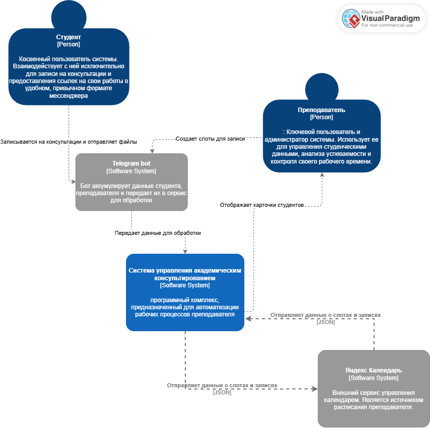

# Лабораторная работа №2

**Тема:** Использование нотации C4 model для проектирования архитектуры программной системы

**Цель работы:** Получить опыт использования графической нотации для фиксации архитектурных решений.

## 1. Диаграмма системного контекста

### Краткое описание основных элементов диаграммы

**Система планирования** – Автоматизирует запись на консультации для студентов и управление временем для преподавателя.  

**Студент** – Косвенный пользователь, который записывается на консультации через Telegram-бота.  

**Преподаватель** – Ключевой пользователь, управляет системой через бота и десктопное приложение.  

**Telegram-бот** – Основной интерфейс для общения системы со студентами и преподавателем.  

**Десктопное приложение** – Административная панель для углублённой работы с данными, используемая преподавателем.  

**Яндекс.Календарь** – Внешний сервис, с которым синхронизируется расписание консультаций.

---

## 2. Диаграмма контейнеров

### Краткое описание основных элементов диаграммы
**Telegram-бот** (Контейнер: Приложение)
Графический интерфейс и точка входа для всех пользователей, который принимает команды и перенаправляет их соответствующим внутренним сервисам.

**Telegram bot Container** (Контейнер: Сервис/Бэкенд)
Отвечает за бизнес-логику обработки данных полученных от телеграм бота. Предобрабатывает, валидирует данные и отправляет их на backend-service.

**backend service** (Контейнер: Сервис/Бэкенд)
Обрабатывает создание, подтверждение, отмену и проверку доступности слотов, проводит аналитику и сохраняет изменения в БД

**База данных** (Контейнер: Данные)
Единое хранилище данных, с которым взаимодействуют все сервисы для сохранения и извлечения информации о студентах, консультациях, бронированиях и преподавателе.

### Обоснование выбора базового архитектурного стиля / архитектуры уровня приложений
Выбранный стиль: **Монолит с чётким модульным разделением.**

Простота развёртывания и управления: Система разворачивается как единое целое, что значительно проще в администрировании, мониторинге и отладке по сравнению с распределённой микросервисной архитектурой для проекта такого масштаба.

Масштабируемость под нагрузку: Внутреннее разделение на сервисы позволяет в будущем при росте нагрузки вынести наиболее нагруженный модуль (например, Сервис бронирования) в отдельный сервис.

Вывод: Для данной системы, где ключевым требованием является консистентность данных (расписание) и оперативность (быстрое создание бронирования), а сложность проекта пока не требует независимого масштабирования компонентов, модульный монолит является оптимальным выбором. 

---

## 3. Диаграмма компонентов - телеграм бот

### Краткое описание основных элементов диаграммы
1. Сервис парсинга
Обрабатывает и валидирует данные полученные от телеграм-бота. Отправляет данные далее для формирования их в нужной форме для аналитики + отправляет данные для логирования, чтобы лучше отслеживать процесс обработки и преобразования полученных данных
2. Сервис логгирования
Пишет полученные данные в .txt файл для сохранения и отслеживания ошибок в случае их возникновения
3. Список формирования
Формирует данные для дальнейшей передачи в backend-service. Таким образом мы разделяем ответственность модулей и ускоряем обработку данных.
---

## 4. Диаграмма компонентов - консультации

**1. Управление расписанием**  Административный компонент для создания, редактирования и отмены слотов консультаций.

**2. Журнал и аналитика консультаций**  Компонент для фиксации результатов проведённых встреч и последующего анализа статистики (загрузка преподавателя, активность студентов).
