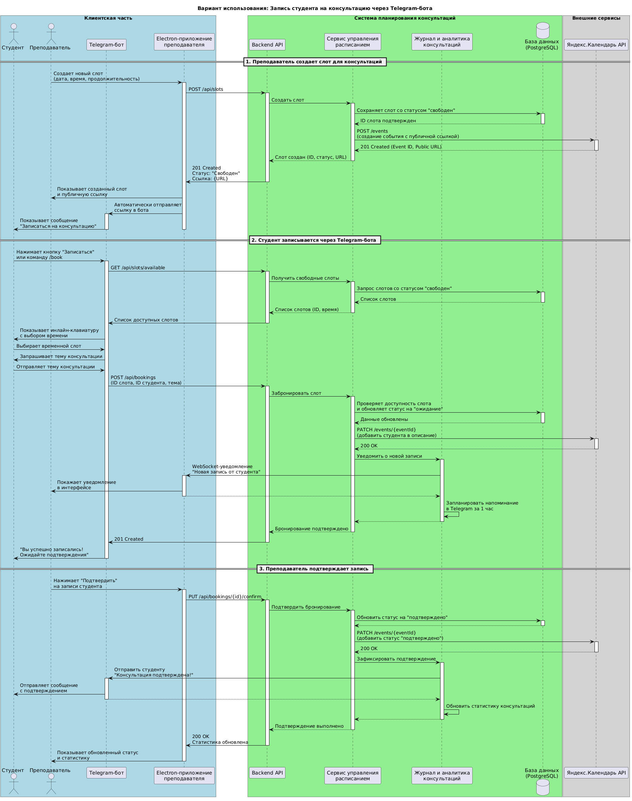
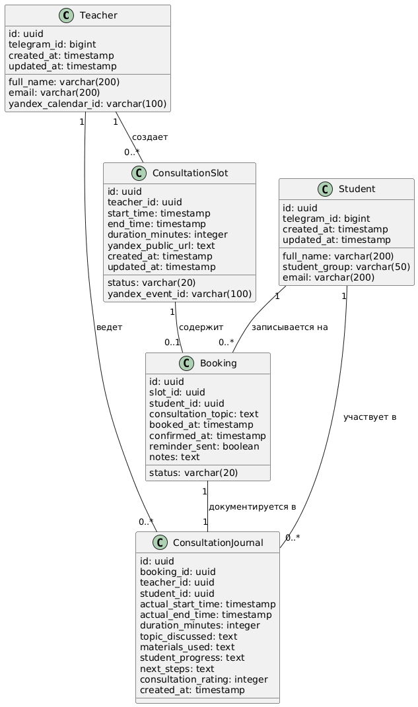

# Диаграмма контейнеров


# Диаграммы компонентов

## Диаграмма компонентов - телеграм бот


## Диаграмма компонентов - консультации


# Диаграмма последовательностей



Вариант использования — Запись студента на консультацию через Telegram-бота.

## Создание и публикация слота преподавателем

Преподаватель через свое Electron-приложение создает новый слот для консультации, указывая время и продолжительность. Backend сохраняет слот в PostgreSQL со статусом "свободен" и через сервис интеграции автоматически создает соответствующее событие в Яндекс.Календаре. Преподаватель получает публичную ссылку на это событие, которая автоматически публикуется телеграм боте.

## Запись студента через Telegram

Студент видит в чате сообщение с приглашением записаться. Взаимодействуя с Telegram-ботом, студент:

* Получает список доступных слотов, который бот запрашивает у Backend API.
* Выбирает удобное время из предложенного списка.
* Указывает тему предстоящей консультации в текстовом сообщении.

## Обработка записи системой

Backend API, получив от бота данные о выборе студента:

1) Через управление расписаний резервирует слот в БД, меняя его статус на "ожидание" и привязывая к карточке студента.
2) Обновляет событие в Яндекс.Календаре, добавляя в описание информацию о студенте и теме.
3) Мгновенно уведомляет преподавателя в его Electron-приложении через WebSocket о новой записи и планирует отправку напоминания в Telegram за час до консультации.
4) Подтверждает боту успешную запись, и бот сообщает студенту, что его запись принята и ожидает подтверждения.

## Подтверждение преподавателем: 

Преподаватель в своем интерфейсе видит новую запись в статусе "ожидание". После проверки он нажимает кнопку подтверждения. Backend:
1) Обновляет статус слота на "подтверждено" в БД.
2) Вносит финальные правки в событие Яндекс.Календаря (например, меняет цвет или добавляет метку).
3) Дает команду Telegram-боту отправить студенту персональное сообщение с подтверждением.
4) Обновляет интерфейс преподавателя и статистику по академической нагрузке.

# Диаграмма UML для базы данных PostgreSQL



Teacher - содержит информацию о преподавателе, основном пользователе системы. Хранит уникальный идентификатор в Telegram для связи с ботом, а также идентификатор Яндекс.Календаря для автоматической синхронизации расписания.

Student - содержит информацию о студентах, косвенных пользователях системы. Включает Telegram ID для коммуникации через бота, академическую группу и контактные данные. Карточки студентов создаются автоматически при первой записи на консультацию.

ConsultationSlot - центральная сущность для управления временными слотами консультаций. Содержит временные параметры, статус слота для визуализации в интерфейсе преподавателя, а также технические поля для интеграции с Яндекс.Календарём.

Booking - управляет процессом бронирования слотов студентами. Фиксирует тему консультации, статус бронирования (ожидание/подтверждено/отменено/завершено).

ConsultationJournal - сущность для ведения академического журнала консультаций. Содержит фактические данные о проведенной консультации, обсуждаемые темы, использованные материалы, оценку прогресса студента и план дальнейших действий. Эта информация формирует статистику академической нагрузки и активность студентов.

# Принципы проектирования

## KISS и DRY
```csharp
public class BookingRepository : IBookingRepository
{
    private readonly ApplicationDbContext _context;
    
    public BookingRepository(ApplicationDbContext context)
    {
        _context = context;
    }
    
    public async Task<Booking> GetByIdAsync(Guid id)
    {
        return await _context.Bookings.FindAsync(id);
    }
    
    public async Task<Booking> GetBySlotIdAsync(Guid slotId)
    {
        return await _context.Bookings
            .FirstOrDefaultAsync(b => b.SlotId == slotId);
    }
    
    public async Task<Guid> CreateAsync(Booking booking)
    {
        _context.Bookings.Add(booking);
        await _context.SaveChangesAsync();
        return booking.Id;
    }
}
```
Простые CRUD операции для работы с БД для базового репозитория всего проекта, вся бизнес-логика в хэндлерах и частично в других частях кода.
При этом, так как мы вынесли общную логику в базовый репозиторий, а специфичную в наследников, то мы выполняем и принцип DRY

## YAGNI

```csharp
public class BookingService : IBookingService
{
    private readonly IBookingRepository _bookingRepository;
    private readonly ISlotRepository _slotRepository;
    private readonly ITelegramBot _telegramBot;
    
    public BookingService(
        IBookingRepository bookingRepository,
        ISlotRepository slotRepository,
        ITelegramBot telegramBot)
    {
        _bookingRepository = bookingRepository;
        _slotRepository = slotRepository;
        _telegramBot = telegramBot;
    }
    
    public async Task<BookingResult> CreateBookingAsync(
        Guid slotId, Guid studentId, string topic)
    {
        var slot = await _slotRepository.GetByIdAsync(slotId);
        if (slot == null)
            return BookingResult.Failed("Слот не найден");
        
        if (slot.Status != SlotStatus.Free)
            return BookingResult.Failed("Слот уже занят");
        
        var booking = new Booking
        {
            SlotId = slotId,
            StudentId = studentId,
            Topic = topic,
            Status = BookingStatus.Pending
        };
        
        var bookingId = await _bookingRepository.CreateAsync(booking);
        
        slot.Status = SlotStatus.Pending;
        await _slotRepository.UpdateAsync(slot);
        
        return BookingResult.Success(bookingId);
    }
}
```
Только базовая логика бронирования. Нет проверки рейтинга студента, нет ограничений по количеству консультаций, нет предварительной валидации темы, в данном случае удовлетворяем еще и MVP - самое важное на данном моменте это работоспособность бронирования, остальное вторично.

## SOLID
```csharp
public interface ISlotService
{
    Task<Guid> CreateSlotAsync(SlotDto dto);
}

public interface INotifier
{
    Task SendAsync(string message, string recipient);
}

public interface ISlotRepository
{
    Task<Guid> CreateAsync(Slot slot);
}

public interface ISlotValidator
{
    Task ValidateAsync(SlotDto dto);
}

public class SlotService : ISlotService
{
    private readonly ISlotRepository _repository;
    private readonly IEnumerable<ISlotValidator> _validators;
    private readonly INotifier _notifier;
    
    public SlotService(
        ISlotRepository repository,
        IEnumerable<ISlotValidator> validators,
        INotifier notifier)
    {
        _repository = repository;
        _validators = validators;
        _notifier = notifier;
    }
    
    public async Task<Guid> CreateSlotAsync(SlotDto dto)
    {
        
        foreach (var validator in _validators)
        {
            await validator.ValidateAsync(dto);
        }
        
        var slot = new Slot
        {
            Id = Guid.NewGuid(),
            StartTime = dto.StartTime,
            EndTime = dto.EndTime,
            ProfessorId = dto.ProfessorId,
            Status = SlotStatus.Free,
            CreatedAt = DateTime.UtcNow
        };
        
        var id = await _repository.CreateAsync(slot);
        
        await _notifier.SendAsync(
            $"Создан слот на {dto.StartTime:dd.MM.yyyy HH:mm}", 
            dto.ProfessorId.ToString()
        );
        
        return id;
    }
}

public class TimeSlotValidator : ISlotValidator
{
    public async Task ValidateAsync(SlotDto dto)
    {
        if (dto.StartTime <= DateTime.UtcNow)
            throw new ValidationException("Время начала должно быть в будущем");
            
        if (dto.EndTime <= dto.StartTime)
            throw new ValidationException("Время окончания должно быть позже начала");
            
        // TODO: Проверить пересечение с существующими слотами
    }
}

public class CapacityValidator : ISlotValidator
{
    public async Task ValidateAsync(SlotDto dto)
    {
        // TODO: Проверить не превышает ли количество слотов дневной лимит + Проверить доступность преподавателя в это время
    }
}

public class TelegramNotifier : INotifier
{
    public async Task SendAsync(string message, string recipient)
    {
        // TODO: Реализовать отправку через Telegram Bot API
        // TODO: Добавить обработку ошибок сети
        // TODO: Добавить повторные попытки при неудаче
    }
}

public class SlotRepository : ISlotRepository
{
    private readonly ApplicationDbContext _context;
    
    public SlotRepository(ApplicationDbContext context)
    {
        _context = context;
    }
    
    public async Task<Guid> CreateAsync(Slot slot)
    {
        await _context.Slots.AddAsync(slot);
        await _context.SaveChangesAsync();
        return slot.Id;
    }
}
```
## S - Single Responsibility

1) SlotService отвечает только за создание слотов, не смешивает логику валидации, отправки уведомлений или работы с БД.
2) TimeSlotValidator валидирует только временные параметры.
3) TelegramNotifier отправляет только уведомления.

## O - Open/Closed

Можно добавить новый ISlotValidator (например, HolidayValidator) без изменения SlotService или добавить новый INotifier без изменения сервиса

## L - Liskov Substitution

* Любой класс, реализующий INotifier (TelegramNotifier, EmailNotifier) может быть подставлен в SlotService;
* Любой валидатор, реализующий ISlotValidator, работает одинаково.

## I - Interface Segregation
* ISlotService имеет только метод создания слотов;
* ISlotRepository имеет только CRUD операции;
* INotifier имеет только метод отправки сообщений.

## D - Dependency Inversion

SlotService зависит от абстракций (ISlotRepository, ISlotValidator, INotifier), а не от конкретных реализаций
