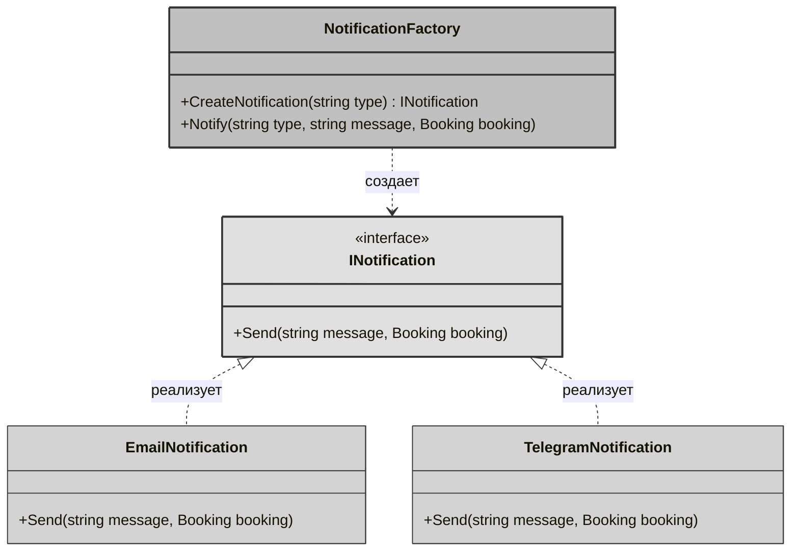
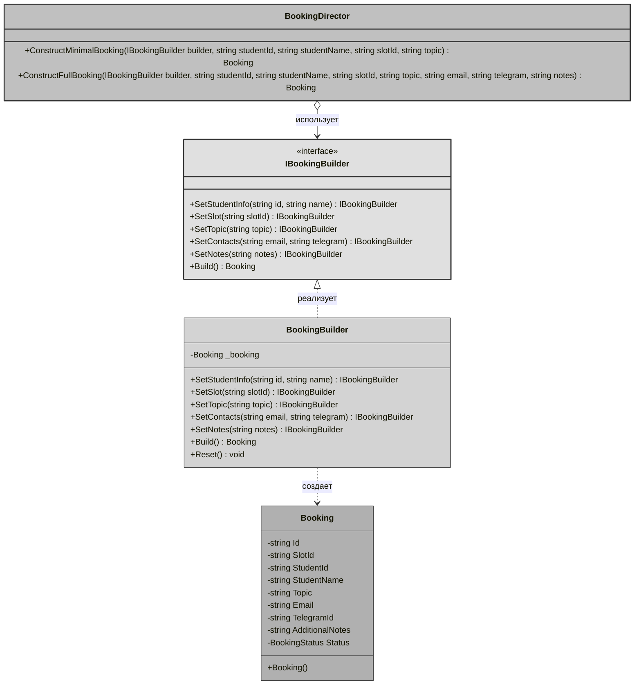
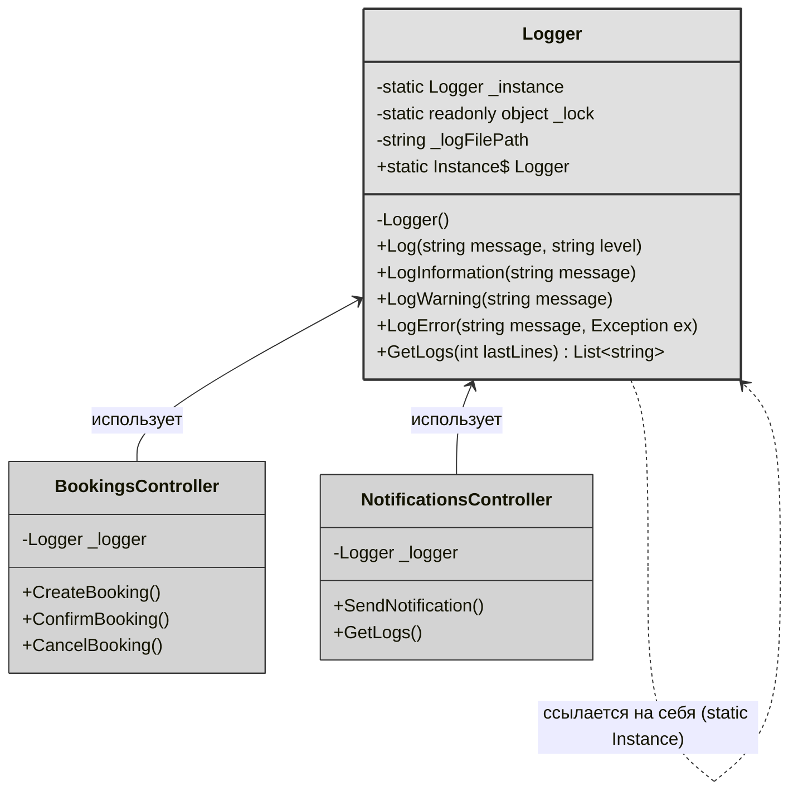

# Отчет по лабораторной работе 6
**Тема**: Использование шаблонов проектирования

**Цель работы**: Получить опыт применения шаблонов проектирования при написании кода программной системы.

## Шаблоны проектирования GoF

### Порождающие шаблоны

### 1. Factory Method (Фабричный метод)

#### Общее назначение
Фабричный метод — это порождающий паттерн проектирования, который определяет общий интерфейс для создания объектов в суперклассе, позволяя подклассам изменять тип создаваемых объектов. В упрощенной реализации — это метод, который создает объекты разных типов, имеющих общий интерфейс.

#### Назначение в проекте
В системе уведомлений используется для создания различных типов уведомлений (Email, Telegram) в зависимости от предпочтений пользователя или наличия контактных данных. Паттерн позволяет централизовать логику создания объектов-уведомлений и легко добавлять новые способы оповещения без изменения существующего кода.

#### UML-диаграмма



**Описание диаграммы:**
- **INotification** интерфейс, определяющий контракт для всех типов уведомлений
- **EmailNotification** и **TelegramNotification** конкретные реализации уведомлений
- **NotificationFactory** фабрика с фабричным методом CreateNotification(), который создает нужный тип уведомления в зависимости от параметра type

#### Фрагмент программного кода

**Интерфейс INotification:**
```csharp
public interface INotification
{
    void Send(string message, Booking booking);
}
```

**Конкретные классы уведомлений:**
```csharp
public class EmailNotification : INotification
{
    public void Send(string message, Booking booking)
    {
        if (string.IsNullOrEmpty(booking.Email))
        {
            Console.WriteLine("Email не указан");
            return;
        }
        
        Console.WriteLine($" EMAIL отправлен на {booking.Email}");
        Console.WriteLine($"   Тема: {booking.Topic}");
        Console.WriteLine($"   Сообщение: {message}");
        Console.WriteLine($"   Студент: {booking.StudentName}");
    }
}

public class TelegramNotification : INotification
{
    public void Send(string message, Booking booking)
    {
        if (string.IsNullOrEmpty(booking.TelegramId))
        {
            Console.WriteLine("Telegram ID не указан");
            return;
        }
        
        Console.WriteLine($" TELEGRAM отправлено пользователю {booking.TelegramId}");
        Console.WriteLine($"   Сообщение: {message}");
        Console.WriteLine($"   Студент: {booking.StudentName}");
        Console.WriteLine($"   Тема: {booking.Topic}");
    }
}
```

**Фабрика с фабричным методом:**
```csharp
public class NotificationFactory
{
    // Фабричный метод - создает нужный тип уведомления
    public INotification CreateNotification(string type)
    {
        return type.ToLower() switch
        {
            "email" => new EmailNotification(),
            "telegram" => new TelegramNotification(),
            _ => throw new ArgumentException($"Неизвестный тип уведомления. Доступны: email, telegram")
        };
    }
    
    // Удобный метод для отправки уведомления
    public void Notify(string type, string message, Booking booking)
    {
        var notification = CreateNotification(type);
        notification.Send(message, booking);
    }
}
```

**Использование в контроллере:**
```csharp
[HttpPost("send-test")]
public IActionResult SendTestNotification([FromQuery] string type)
{
    try
    {
        var booking = new Booking
        {
            Id = Guid.NewGuid().ToString(),
            StudentName = "Тестовый Студент",
            Email = "test@mail.com",
            TelegramId = "@test",
            Topic = "Тестовая консультация"
        };
        
        var factory = new NotificationFactory();
        factory.Notify(type, "Напоминание о консультации", booking);
        
        return Ok(new 
        { 
            success = true, 
            message = $"Уведомление типа '{type}' отправлено",
            bookingId = booking.Id
        });
    }
    catch (Exception ex)
    {
        return BadRequest(new { success = false, error = ex.Message });
    }
}
```

### 2. Builder (Строитель)

#### Общее назначение
Строитель — это порождающий паттерн проектирования, который позволяет создавать сложные объекты пошагово. В отличие от других порождающих паттернов, Строитель позволяет производить различные представления объекта, используя один и тот же процесс конструирования.

#### Назначение в проекте 
В системе используется для создания объекта `Booking` (бронирование), который имеет множество полей, включая обязательные и опциональные. Паттерн позволяет:
- Пошагово заполнять информацию о бронировании
- Делать код более читаемым при создании сложных объектов
- Создавать разные варианты бронирования (с контактами или без, с заметками и т.д.)

#### UML-диаграмма



**Описание диаграммы:**
- **IBookingBuilder** интерфейс строителя, определяющий шаги создания объекта
- **BookingBuilder** конкретная реализация строителя для создания бронирований
- **Booking** продукт, который создается строителем
- **BookingDirector** директор, который управляет процессом создания (опционально)

#### Фрагмент программного кода

**Интерфейс строителя:**
```csharp
public interface IBookingBuilder
{
    IBookingBuilder SetStudentInfo(string id, string name);
    IBookingBuilder SetSlot(string slotId);
    IBookingBuilder SetTopic(string topic);
    IBookingBuilder SetContacts(string? email, string? telegramId);
    IBookingBuilder SetNotes(string? notes);
    Booking Build();
}
```

**Конкретный строитель:**
```csharp
public class BookingBuilder : IBookingBuilder
{
    private Booking _booking;
    
    public BookingBuilder()
    {
        Reset();
    }
    
    private void Reset()
    {
        _booking = new Booking
        {
            Id = Guid.NewGuid().ToString(),
            Status = BookingStatus.Pending,
            CreatedAt = DateTime.UtcNow
        };
    }
    
    public IBookingBuilder SetStudentInfo(string id, string name)
    {
        _booking.StudentId = id;
        _booking.StudentName = name;
        return this;
    }
    
    public IBookingBuilder SetSlot(string slotId)
    {
        _booking.SlotId = slotId;
        return this;
    }
    
    public IBookingBuilder SetTopic(string topic)
    {
        _booking.Topic = topic;
        return this;
    }
    
    public IBookingBuilder SetContacts(string? email, string? telegramId)
    {
        _booking.Email = email;
        _booking.TelegramId = telegramId;
        return this;
    }
    
    public IBookingBuilder SetNotes(string? notes)
    {
        _booking.AdditionalNotes = notes;
        return this;
    }
    
    public Booking Build()
    {
        // Валидация обязательных полей
        if (string.IsNullOrEmpty(_booking.StudentId))
            throw new InvalidOperationException("StudentId is required");
            
        if (string.IsNullOrEmpty(_booking.SlotId))
            throw new InvalidOperationException("SlotId is required");
            
        if (string.IsNullOrEmpty(_booking.Topic))
            throw new InvalidOperationException("Topic is required");
        
        var result = _booking;
        Reset(); // Сбрасываем для следующего использования
        return result;
    }
}
```

**Директор:**
```csharp
public class BookingDirector
{
    // Создание минимального бронирования (только обязательные поля)
    public Booking ConstructMinimalBooking(
        IBookingBuilder builder, 
        string studentId, 
        string studentName, 
        string slotId, 
        string topic)
    {
        return builder
            .SetStudentInfo(studentId, studentName)
            .SetSlot(slotId)
            .SetTopic(topic)
            .Build();
    }
    
    // Создание полного бронирования (со всеми контактами)
    public Booking ConstructFullBooking(
        IBookingBuilder builder,
        string studentId,
        string studentName,
        string slotId,
        string topic,
        string? email,
        string? telegramId,
        string? notes)
    {
        return builder
            .SetStudentInfo(studentId, studentName)
            .SetSlot(slotId)
            .SetTopic(topic)
            .SetContacts(email, telegramId)
            .SetNotes(notes)
            .Build();
    }
}
```

**Использование в контроллере:**
```csharp
[HttpPost("create-with-builder")]
public async Task<IActionResult> CreateBookingWithBuilder([FromBody] CreateBookingRequest request)
{
    try
    {
        // Проверяем существование слота
        var slot = await _context.Slots.FirstOrDefaultAsync(s => s.Id == request.SlotId);
        if (slot == null)
            return NotFound("Слот не найден");
            
        if (slot.Status != SlotStatus.Free)
            return BadRequest("Слот уже занят");
        
        // Используем Builder для создания бронирования
        var builder = new BookingBuilder();
        
        var booking = builder
            .SetStudentInfo(request.StudentId, request.StudentName)
            .SetSlot(request.SlotId)
            .SetTopic(request.Topic)
            .SetContacts(request.Email, request.TelegramId)
            .SetNotes(request.AdditionalNotes)
            .Build();
        
        // Обновляем статус слота
        slot.Status = SlotStatus.Pending;
        
        // Сохраняем в БД
        _context.Bookings.Add(booking);
        await _context.SaveChangesAsync();
        
        // Отправляем уведомление через фабрику
        if (!string.IsNullOrEmpty(booking.Email))
        {
            var notificationFactory = new NotificationFactory();
            notificationFactory.Notify("email", "Ваша заявка на консультацию получена", booking);
        }
        
        return Ok(new CreateBookingResponse
        {
            BookingId = booking.Id,
            Status = booking.Status,
            SlotId = booking.SlotId,
            StudentId = booking.StudentId,
            Topic = booking.Topic,
            CreatedAt = booking.CreatedAt
        });
    }
    catch (InvalidOperationException ex)
    {
        return BadRequest(ex.Message);
    }
    catch (Exception ex)
    {
        _logger.LogError(ex, "Ошибка при создании бронирования");
        return StatusCode(500, "Внутренняя ошибка сервера");
    }
}
```

**Использование директора для стандартных сценариев:**
```csharp
[HttpPost("quick-booking")]
public async Task<IActionResult> QuickBooking(string studentId, string slotId)
{
    // Быстрое создание бронирования с минимальными данными
    var director = new BookingDirector();
    var builder = new BookingBuilder();
    
    var booking = director.ConstructMinimalBooking(
        builder, 
        studentId, 
        "Студент",
        slotId, 
        "Консультация"
    );
    return Ok(booking);
}
```
### 3. Singleton (Одиночка)

#### Общее назначение
Одиночка — это порождающий паттерн проектирования, который гарантирует, что у класса есть только один экземпляр, и предоставляет глобальную точку доступа к этому экземпляру. Ключевая особенность - класс содержит статическую ссылку на самого себя, а конструктор делается приватным, чтобы предотвратить создание объектов извне.

#### Назначение в проекте "Система управления консультациями"
В системе используется для создания единого логгера, который записывает все действия в системе:
- Создание бронирований
- Отправку уведомлений
- Ошибки и предупреждения
- Информационные сообщения

Это гарантирует, что все компоненты системы пишут в один и тот же файл лога, и нет конфликтов при одновременной записи из разных частей приложения.

#### UML-диаграмма



**Описание диаграммы:**
- **Logger** класс-одиночка с приватным конструктором и статической ссылкой на самого себя (`_instance`)
- Стрелка от Logger к самой себе показывает, что класс хранит ссылку на собственный экземпляр
- **BookingsController** и **NotificationsController** используют единый экземпляр логгера через статическое свойство `Instance`
- Все обращения из разных контроллеров ведут к одному и тому же объекту

#### Фрагмент программного кода

**Класс-одиночка Logger:**

```csharp
using System;
using System.Collections.Generic;
using System.IO;

namespace ConsultationAPI.Services
{
    public class Logger
    {
        // Статическая переменная для хранения единственного экземпляра (ссылка на самого себя)
        private static Logger? _instance;
        
        // Объект для потокобезопасности
        private static readonly object _lock = new object();
        
        // Путь к файлу лога
        private readonly string _logFilePath;
        
        // Приватный конструктор - предотвращает создание экземпляров извне
        private Logger()
        {
            _logFilePath = "logs.txt";
            
            // Создаем директорию для логов, если её нет
            var logDirectory = Path.GetDirectoryName(_logFilePath);
            if (!string.IsNullOrEmpty(logDirectory) && !Directory.Exists(logDirectory))
            {
                Directory.CreateDirectory(logDirectory);
            }
            
            // Записываем начало сессии
            Log("Сессия запущена", "INFO");
        }
        
        // Публичное статическое свойство для доступа к экземпляру
        public static Logger Instance
        {
            get
            {
                // Потокобезопасная инициализация (ленивая загрузка)
                lock (_lock)
                {
                    if (_instance == null)
                    {
                        _instance = new Logger(); // Создаем экземпляр самого себя
                    }
                    return _instance;
                }
            }
        }
        
        // Базовый метод логирования
        public void Log(string message, string level = "INFO")
        {
            var logEntry = $"[{DateTime.Now:yyyy-MM-dd HH:mm:ss}] [{level}] {message}";
            
            // Выводим в консоль
            Console.WriteLine(logEntry);
            
            // Записываем в файл
            lock (_lock)
            {
                File.AppendAllText(_logFilePath, logEntry + Environment.NewLine);
            }
        }
        
        // Удобные методы для разных уровней логирования
        public void LogInformation(string message)
        {
            Log(message, "INFO");
        }
        
        public void LogWarning(string message)
        {
            Log(message, "WARNING");
        }
        
        public void LogError(string message, Exception? ex = null)
        {
            Log($"{message}. Ошибка: {ex?.Message}", "ERROR");
            if (ex?.StackTrace != null)
            {
                Log($"Stack Trace: {ex.StackTrace}", "ERROR");
            }
        }

        public List<string> GetLogs(int lastLines = 100)
        {
            lock (_lock)
            {
                if (!File.Exists(_logFilePath))
                    return new List<string>();
                    
                return File.ReadLines(_logFilePath)
                    .Reverse()
                    .Take(lastLines)
                    .Reverse()
                    .ToList();
            }
        }
    }
}
```
