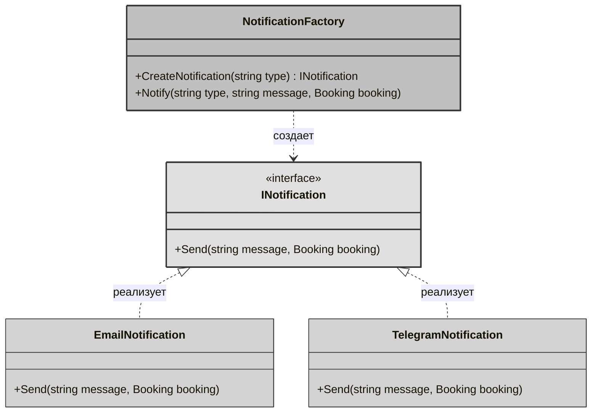
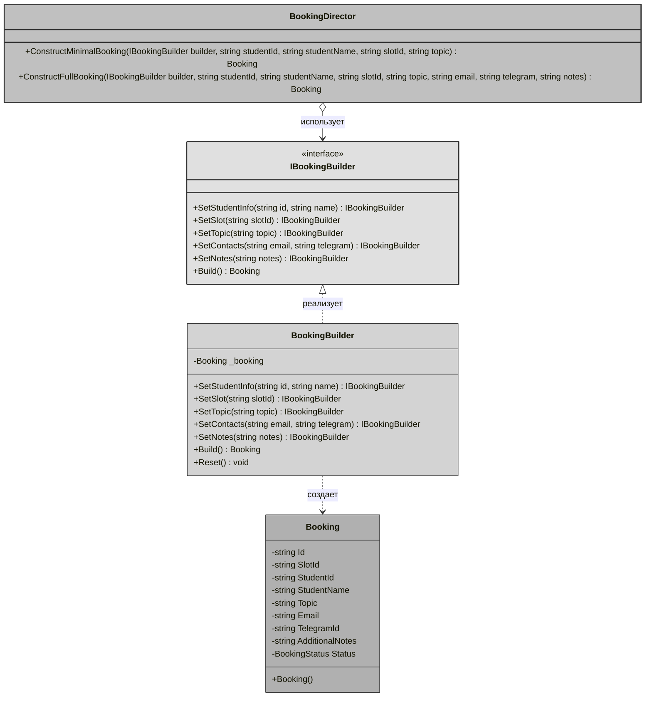
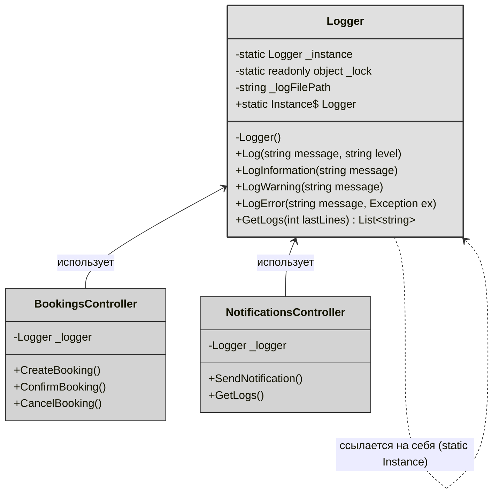
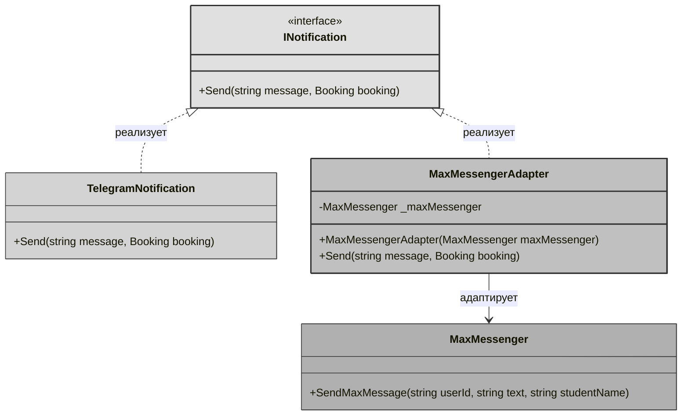
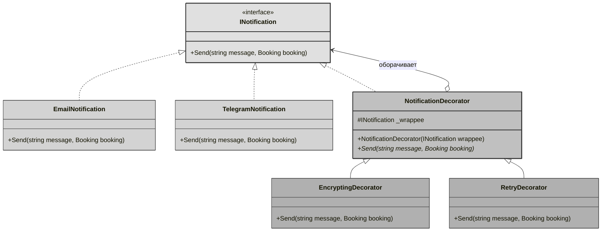
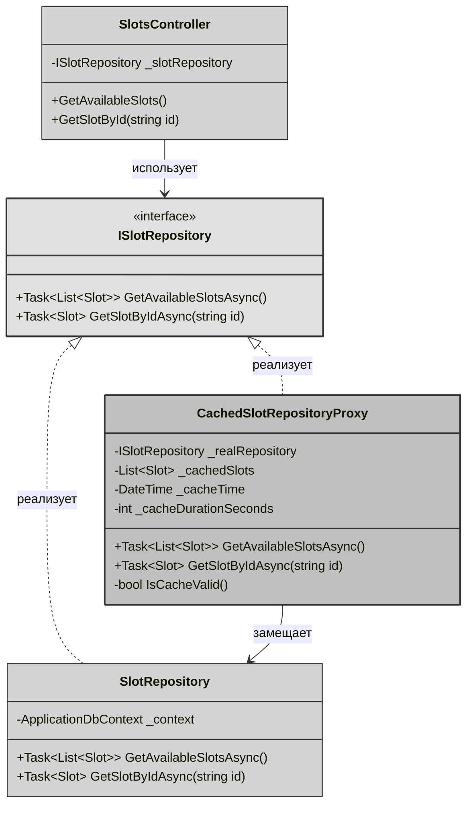
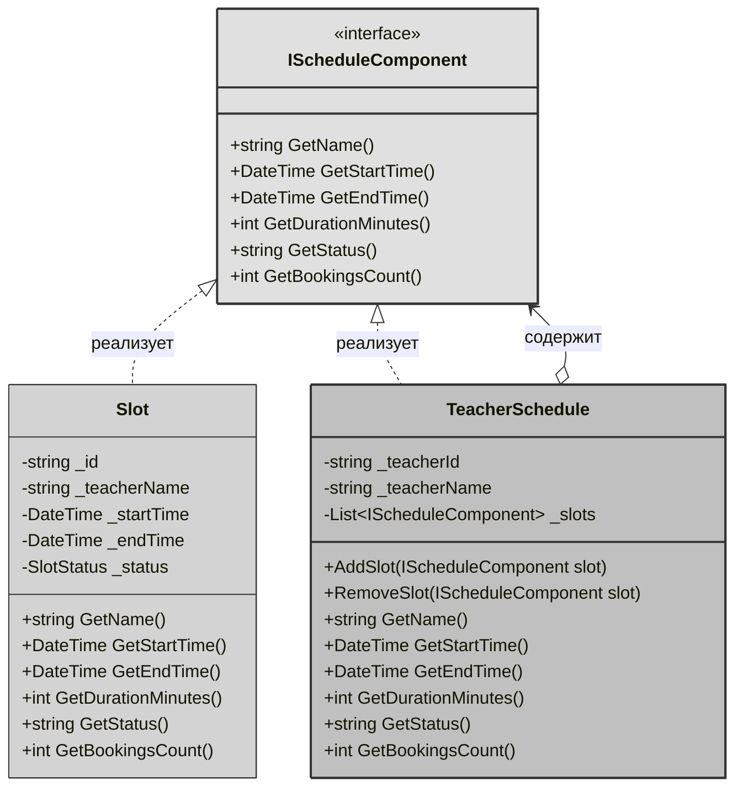

# Отчет по лабораторной работе 6
**Тема**: Использование шаблонов проектирования

**Цель работы**: Получить опыт применения шаблонов проектирования при написании кода программной системы.

## Шаблоны проектирования GoF

### Порождающие шаблоны

### 1. Factory Method (Фабричный метод)

#### Общее назначение
Фабричный метод — это порождающий паттерн проектирования, который определяет общий интерфейс для создания объектов в суперклассе, позволяя подклассам изменять тип создаваемых объектов. В упрощенной реализации — это метод, который создает объекты разных типов, имеющих общий интерфейс.

#### Назначение в проекте
В системе уведомлений используется для создания различных типов уведомлений (Email, Telegram) в зависимости от предпочтений пользователя или наличия контактных данных. Паттерн позволяет централизовать логику создания объектов-уведомлений и легко добавлять новые способы оповещения без изменения существующего кода.

#### UML-диаграмма



**Описание диаграммы:**
- **INotification** интерфейс, определяющий контракт для всех типов уведомлений
- **EmailNotification** и **TelegramNotification** конкретные реализации уведомлений
- **NotificationFactory** фабрика с фабричным методом CreateNotification(), который создает нужный тип уведомления в зависимости от параметра type

#### Фрагмент программного кода

**Интерфейс INotification:**
```csharp
public interface INotification
{
    void Send(string message, Booking booking);
}
```

**Конкретные классы уведомлений:**
```csharp
public class EmailNotification : INotification
{
    public void Send(string message, Booking booking)
    {
        if (string.IsNullOrEmpty(booking.Email))
        {
            Console.WriteLine("Email не указан");
            return;
        }
        
        Console.WriteLine($" EMAIL отправлен на {booking.Email}");
        Console.WriteLine($"   Тема: {booking.Topic}");
        Console.WriteLine($"   Сообщение: {message}");
        Console.WriteLine($"   Студент: {booking.StudentName}");
    }
}

public class TelegramNotification : INotification
{
    public void Send(string message, Booking booking)
    {
        if (string.IsNullOrEmpty(booking.TelegramId))
        {
            Console.WriteLine("Telegram ID не указан");
            return;
        }
        
        Console.WriteLine($" TELEGRAM отправлено пользователю {booking.TelegramId}");
        Console.WriteLine($"   Сообщение: {message}");
        Console.WriteLine($"   Студент: {booking.StudentName}");
        Console.WriteLine($"   Тема: {booking.Topic}");
    }
}
```

**Фабрика с фабричным методом:**
```csharp
public class NotificationFactory
{
    // Фабричный метод - создает нужный тип уведомления
    public INotification CreateNotification(string type)
    {
        return type.ToLower() switch
        {
            "email" => new EmailNotification(),
            "telegram" => new TelegramNotification(),
            _ => throw new ArgumentException($"Неизвестный тип уведомления. Доступны: email, telegram")
        };
    }
    
    // Удобный метод для отправки уведомления
    public void Notify(string type, string message, Booking booking)
    {
        var notification = CreateNotification(type);
        notification.Send(message, booking);
    }
}
```

**Использование в контроллере:**
```csharp
[HttpPost("send-test")]
public IActionResult SendTestNotification([FromQuery] string type)
{
    try
    {
        var booking = new Booking
        {
            Id = Guid.NewGuid().ToString(),
            StudentName = "Тестовый Студент",
            Email = "test@mail.com",
            TelegramId = "@test",
            Topic = "Тестовая консультация"
        };
        
        var factory = new NotificationFactory();
        factory.Notify(type, "Напоминание о консультации", booking);
        
        return Ok(new 
        { 
            success = true, 
            message = $"Уведомление типа '{type}' отправлено",
            bookingId = booking.Id
        });
    }
    catch (Exception ex)
    {
        return BadRequest(new { success = false, error = ex.Message });
    }
}
```

### 2. Builder (Строитель)

#### Общее назначение
Строитель — это порождающий паттерн проектирования, который позволяет создавать сложные объекты пошагово. В отличие от других порождающих паттернов, Строитель позволяет производить различные представления объекта, используя один и тот же процесс конструирования.

#### Назначение в проекте 
В системе используется для создания объекта `Booking` (бронирование), который имеет множество полей, включая обязательные и опциональные. Паттерн позволяет:
- Пошагово заполнять информацию о бронировании
- Делать код более читаемым при создании сложных объектов
- Создавать разные варианты бронирования (с контактами или без, с заметками и т.д.)

#### UML-диаграмма



**Описание диаграммы:**
- **IBookingBuilder** интерфейс строителя, определяющий шаги создания объекта
- **BookingBuilder** конкретная реализация строителя для создания бронирований
- **Booking** продукт, который создается строителем
- **BookingDirector** директор, который управляет процессом создания (опционально)

#### Фрагмент программного кода

**Интерфейс строителя:**
```csharp
public interface IBookingBuilder
{
    IBookingBuilder SetStudentInfo(string id, string name);
    IBookingBuilder SetSlot(string slotId);
    IBookingBuilder SetTopic(string topic);
    IBookingBuilder SetContacts(string? email, string? telegramId);
    IBookingBuilder SetNotes(string? notes);
    Booking Build();
}
```

**Конкретный строитель:**
```csharp
public class BookingBuilder : IBookingBuilder
{
    private Booking _booking;
    
    public BookingBuilder()
    {
        Reset();
    }
    
    private void Reset()
    {
        _booking = new Booking
        {
            Id = Guid.NewGuid().ToString(),
            Status = BookingStatus.Pending,
            CreatedAt = DateTime.UtcNow
        };
    }
    
    public IBookingBuilder SetStudentInfo(string id, string name)
    {
        _booking.StudentId = id;
        _booking.StudentName = name;
        return this;
    }
    
    public IBookingBuilder SetSlot(string slotId)
    {
        _booking.SlotId = slotId;
        return this;
    }
    
    public IBookingBuilder SetTopic(string topic)
    {
        _booking.Topic = topic;
        return this;
    }
    
    public IBookingBuilder SetContacts(string? email, string? telegramId)
    {
        _booking.Email = email;
        _booking.TelegramId = telegramId;
        return this;
    }
    
    public IBookingBuilder SetNotes(string? notes)
    {
        _booking.AdditionalNotes = notes;
        return this;
    }
    
    public Booking Build()
    {
        // Валидация обязательных полей
        if (string.IsNullOrEmpty(_booking.StudentId))
            throw new InvalidOperationException("StudentId is required");
            
        if (string.IsNullOrEmpty(_booking.SlotId))
            throw new InvalidOperationException("SlotId is required");
            
        if (string.IsNullOrEmpty(_booking.Topic))
            throw new InvalidOperationException("Topic is required");
        
        var result = _booking;
        Reset(); // Сбрасываем для следующего использования
        return result;
    }
}
```

**Директор:**
```csharp
public class BookingDirector
{
    // Создание минимального бронирования (только обязательные поля)
    public Booking ConstructMinimalBooking(
        IBookingBuilder builder, 
        string studentId, 
        string studentName, 
        string slotId, 
        string topic)
    {
        return builder
            .SetStudentInfo(studentId, studentName)
            .SetSlot(slotId)
            .SetTopic(topic)
            .Build();
    }
    
    // Создание полного бронирования (со всеми контактами)
    public Booking ConstructFullBooking(
        IBookingBuilder builder,
        string studentId,
        string studentName,
        string slotId,
        string topic,
        string? email,
        string? telegramId,
        string? notes)
    {
        return builder
            .SetStudentInfo(studentId, studentName)
            .SetSlot(slotId)
            .SetTopic(topic)
            .SetContacts(email, telegramId)
            .SetNotes(notes)
            .Build();
    }
}
```

**Использование в контроллере:**
```csharp
[HttpPost("create-with-builder")]
public async Task<IActionResult> CreateBookingWithBuilder([FromBody] CreateBookingRequest request)
{
    try
    {
        // Проверяем существование слота
        var slot = await _context.Slots.FirstOrDefaultAsync(s => s.Id == request.SlotId);
        if (slot == null)
            return NotFound("Слот не найден");
            
        if (slot.Status != SlotStatus.Free)
            return BadRequest("Слот уже занят");
        
        // Используем Builder для создания бронирования
        var builder = new BookingBuilder();
        
        var booking = builder
            .SetStudentInfo(request.StudentId, request.StudentName)
            .SetSlot(request.SlotId)
            .SetTopic(request.Topic)
            .SetContacts(request.Email, request.TelegramId)
            .SetNotes(request.AdditionalNotes)
            .Build();
        
        // Обновляем статус слота
        slot.Status = SlotStatus.Pending;
        
        // Сохраняем в БД
        _context.Bookings.Add(booking);
        await _context.SaveChangesAsync();
        
        // Отправляем уведомление через фабрику
        if (!string.IsNullOrEmpty(booking.Email))
        {
            var notificationFactory = new NotificationFactory();
            notificationFactory.Notify("email", "Ваша заявка на консультацию получена", booking);
        }
        
        return Ok(new CreateBookingResponse
        {
            BookingId = booking.Id,
            Status = booking.Status,
            SlotId = booking.SlotId,
            StudentId = booking.StudentId,
            Topic = booking.Topic,
            CreatedAt = booking.CreatedAt
        });
    }
    catch (InvalidOperationException ex)
    {
        return BadRequest(ex.Message);
    }
    catch (Exception ex)
    {
        _logger.LogError(ex, "Ошибка при создании бронирования");
        return StatusCode(500, "Внутренняя ошибка сервера");
    }
}
```

**Использование директора для стандартных сценариев:**
```csharp
[HttpPost("quick-booking")]
public async Task<IActionResult> QuickBooking(string studentId, string slotId)
{
    // Быстрое создание бронирования с минимальными данными
    var director = new BookingDirector();
    var builder = new BookingBuilder();
    
    var booking = director.ConstructMinimalBooking(
        builder, 
        studentId, 
        "Студент",
        slotId, 
        "Консультация"
    );
    return Ok(booking);
}
```
### 3. Singleton (Одиночка)

#### Общее назначение
Одиночка — это порождающий паттерн проектирования, который гарантирует, что у класса есть только один экземпляр, и предоставляет глобальную точку доступа к этому экземпляру. Ключевая особенность - класс содержит статическую ссылку на самого себя, а конструктор делается приватным, чтобы предотвратить создание объектов извне.

#### Назначение в проекте "Система управления консультациями"
В системе используется для создания единого логгера, который записывает все действия в системе:
- Создание бронирований
- Отправку уведомлений
- Ошибки и предупреждения
- Информационные сообщения

Это гарантирует, что все компоненты системы пишут в один и тот же файл лога, и нет конфликтов при одновременной записи из разных частей приложения.

#### UML-диаграмма



**Описание диаграммы:**
- **Logger** класс-одиночка с приватным конструктором и статической ссылкой на самого себя (`_instance`)
- Стрелка от Logger к самой себе показывает, что класс хранит ссылку на собственный экземпляр
- **BookingsController** и **NotificationsController** используют единый экземпляр логгера через статическое свойство `Instance`
- Все обращения из разных контроллеров ведут к одному и тому же объекту

#### Фрагмент программного кода

**Класс-одиночка Logger:**

```csharp
using System;
using System.Collections.Generic;
using System.IO;

namespace ConsultationAPI.Services
{
    public class Logger
    {
        // Статическая переменная для хранения единственного экземпляра (ссылка на самого себя)
        private static Logger? _instance;
        
        // Объект для потокобезопасности
        private static readonly object _lock = new object();
        
        // Путь к файлу лога
        private readonly string _logFilePath;
        
        // Приватный конструктор - предотвращает создание экземпляров извне
        private Logger()
        {
            _logFilePath = "logs.txt";
            
            // Создаем директорию для логов, если её нет
            var logDirectory = Path.GetDirectoryName(_logFilePath);
            if (!string.IsNullOrEmpty(logDirectory) && !Directory.Exists(logDirectory))
            {
                Directory.CreateDirectory(logDirectory);
            }
            
            // Записываем начало сессии
            Log("Сессия запущена", "INFO");
        }
        
        // Публичное статическое свойство для доступа к экземпляру
        public static Logger Instance
        {
            get
            {
                // Потокобезопасная инициализация (ленивая загрузка)
                lock (_lock)
                {
                    if (_instance == null)
                    {
                        _instance = new Logger(); // Создаем экземпляр самого себя
                    }
                    return _instance;
                }
            }
        }
        
        // Базовый метод логирования
        public void Log(string message, string level = "INFO")
        {
            var logEntry = $"[{DateTime.Now:yyyy-MM-dd HH:mm:ss}] [{level}] {message}";
            
            // Выводим в консоль
            Console.WriteLine(logEntry);
            
            // Записываем в файл
            lock (_lock)
            {
                File.AppendAllText(_logFilePath, logEntry + Environment.NewLine);
            }
        }
        
        // Удобные методы для разных уровней логирования
        public void LogInformation(string message)
        {
            Log(message, "INFO");
        }
        
        public void LogWarning(string message)
        {
            Log(message, "WARNING");
        }
        
        public void LogError(string message, Exception? ex = null)
        {
            Log($"{message}. Ошибка: {ex?.Message}", "ERROR");
            if (ex?.StackTrace != null)
            {
                Log($"Stack Trace: {ex.StackTrace}", "ERROR");
            }
        }

        public List<string> GetLogs(int lastLines = 100)
        {
            lock (_lock)
            {
                if (!File.Exists(_logFilePath))
                    return new List<string>();
                    
                return File.ReadLines(_logFilePath)
                    .Reverse()
                    .Take(lastLines)
                    .Reverse()
                    .ToList();
            }
        }
    }
}
```

### 4. Adapter (Адаптер)

#### Общее назначение
Адаптер — это структурный паттерн проектирования, который позволяет объектам с несовместимыми интерфейсами работать вместе. Он выступает в роли моста, преобразуя вызовы одного интерфейса в вызовы другого, не изменяя их исходный код.

#### Назначение в проекте "Система управления консультациями"
В системе существует единый интерфейс `INotification` для отправки уведомлений. В данный момент все уведомления отправляются через Telegram с помощью класса `TelegramNotification`. Однако в будущем может потребоваться интеграция с другим мессенджером, например **MaxMessenger**, который имеет несовместимый интерфейс (метод `SendMaxMessage` с другими параметрами). Паттерн Adapter позволяет создать класс-адаптер, который приведёт интерфейс MaxMessenger к стандарту `INotification`, не меняя код ни существующей системы, ни самого MaxMessenger. На данный момент адаптер написан и хранится в проекте "про запас", готовый к использованию при необходимости.

#### UML-диаграмма



**Описание диаграммы:**
- **INotification** целевой интерфейс, используемый в системе.
- **TelegramNotification** существующая реализация, работающая напрямую.
- **MaxMessenger** внешний класс с несовместимым интерфейсом (Adaptee).
- **MaxMessengerAdapter** адаптер, реализующий интерфейс `INotification` и перенаправляющий вызовы к `MaxMessenger` с преобразованием параметров.

#### Фрагмент программного кода

**Интерфейс INotification (целевой интерфейс):**
```csharp
public interface INotification
{
    void Send(string message, Booking booking);
}
```

**Существующая реализация для Telegram:**
```csharp
public class TelegramNotification : INotification
{
    public void Send(string message, Booking booking)
    {
        if (string.IsNullOrEmpty(booking.TelegramId))
        {
            Console.WriteLine("Telegram ID не указан, уведомление не отправлено");
            return;
        }
        
        Console.WriteLine($" TELEGRAM отправлено пользователю {booking.TelegramId}");
        Console.WriteLine($"   Сообщение: {message}");
        Console.WriteLine($"   Студент: {booking.StudentName}");
    }
}
```

**Внешний класс с несовместимым интерфейсом (Adaptee):**
```csharp
public class MaxMessenger
{
    public void SendMaxMessage(string userId, string text, string studentName)
    {
        Console.WriteLine($" MAX MESSENGER -> {userId}");
        Console.WriteLine($"   Сообщение: {text}");
        Console.WriteLine($"   Студент: {studentName}");
        Console.WriteLine($"   Отправлено через MaxMessenger");
    }
}
```

**Адаптер, приводящий интерфейс MaxMessenger к INotification:**
```csharp
public class MaxMessengerAdapter : INotification
{
    private readonly MaxMessenger _maxMessenger;
    
    public MaxMessengerAdapter(MaxMessenger maxMessenger)
    {
        _maxMessenger = maxMessenger;
    }
    
    public void Send(string message, Booking booking)
    {
        // Преобразуем данные из Booking в параметры для MaxMessenger
        string userId = booking.TelegramId ?? "unknown_user";
        string studentName = booking.StudentName;
        
        _maxMessenger.SendMaxMessage(userId, message, studentName);
    }
}
```
### 5. Decorator (Декоратор)

#### Общее назначение
Декоратор — это структурный паттерн, который позволяет динамически добавлять объектам новую функциональность, оборачивая их в полезные «обёртки». Декоратор предоставляет гибкую альтернативу созданию подклассов для расширения функциональности.

#### Назначение в проекте 
В системе есть базовые уведомления (Email, Telegram). Иногда требуется дополнительная функциональность: шифрование сообщений или автоматические повторные попытки при ошибках. Паттерн Decorator позволяет «обернуть» базовое уведомление в декораторы, добавляющие такое поведение, без изменения кода самих уведомлений.

#### UML-диаграмма



**Описание диаграммы:**
- **INotification** общий интерфейс для всех уведомлений.
- **EmailNotification**, **TelegramNotification** конкретные компоненты, реализующие базовую функциональность.
- **NotificationDecorator** абстрактный декоратор, хранит ссылку на оборачиваемый объект и делегирует ему выполнение.
- **EncryptingDecorator**, **RetryDecorator** конкретные декораторы, добавляющие своё поведение до/после вызова обёрнутого объекта.

#### Фрагмент программного кода

**Базовый интерфейс и компоненты:**
```csharp
public interface INotification
{
    void Send(string message, Booking booking);
}

public class TelegramNotification : INotification
{
    public void Send(string message, Booking booking)
    {
        Console.WriteLine($"TELEGRAM: {booking.TelegramId} - {message}");
    }
}

public class EmailNotification : INotification
{
    public void Send(string message, Booking booking)
    {
        Console.WriteLine($"EMAIL: {booking.Email} - {message}");
    }
}
```

**Абстрактный декоратор:**
```csharp
public abstract class NotificationDecorator : INotification
{
    protected INotification _wrappee;

    public NotificationDecorator(INotification wrappee)
    {
        _wrappee = wrappee;
    }

    public virtual void Send(string message, Booking booking)
    {
        _wrappee.Send(message, booking);
    }
}
```

**Декоратор шифрования:**
```csharp
public class EncryptingDecorator : NotificationDecorator
{
    public EncryptingDecorator(INotification wrappee) : base(wrappee) { }

    public override void Send(string message, Booking booking)
    {
        string encrypted = $"ENCRYPTED[{message}]";
        Console.WriteLine("Сообщение зашифровано");
        base.Send(encrypted, booking);
    }
}
```

**Декоратор повторных попыток:**
```csharp
public class RetryDecorator : NotificationDecorator
{
    private readonly int _maxRetries;

    public RetryDecorator(INotification wrappee, int maxRetries = 3) : base(wrappee)
    {
        _maxRetries = maxRetries;
    }

    public override void Send(string message, Booking booking)
    {
        int attempt = 0;
        bool sent = false;
        
        while (!sent && attempt < _maxRetries)
        {
            try
            {
                attempt++;
                Console.WriteLine($"Попытка отправки #{attempt}");
                
                base.Send(message, booking);
                
                sent = true;
                Console.WriteLine("Отправлено успешно");
            }
            catch (Exception ex)
            {
                Console.WriteLine($"Ошибка: {ex.Message}");
                
                if (attempt >= _maxRetries)
                {
                    Console.WriteLine("Все попытки исчерпаны");
                    throw;
                }
                
                Console.WriteLine("Повтор через 1 секунду...");
                Thread.Sleep(1000);
            }
        }
    }
}
```
### 6. Proxy (Заместитель)

#### Общее назначение
Proxy — это структурный паттерн, который предоставляет объект-заместитель, контролирующий доступ к другому объекту. Заместитель имеет тот же интерфейс, что и реальный объект, поэтому для клиента нет разницы — он работает с заместителем или с реальным объектом.

#### Назначение в проекте "Система управления консультациями"
В системе часто выполняются запросы к базе данных для получения списка свободных слотов. Если слоты обновляются нечасто, можно использовать Proxy для кэширования результатов. Это уменьшит количество обращений к базе данных и ускорит ответы системы.

#### UML-диаграмма



**Описание диаграммы:**
- **ISlotRepository** общий интерфейс для работы со слотами
- **SlotRepository** реальный объект, работающий с базой данных
- **CachedSlotRepositoryProxy** заместитель с кэшированием
- **SlotsController** клиент, который не знает, работает с реальным объектом или заместителем

#### Фрагмент программного кода

**Интерфейс репозитория:**

```csharp
using ConsultationAPI.Models;

namespace ConsultationAPI.Interfaces
{
    public interface ISlotRepository
    {
        Task<List<Slot>> GetAvailableSlotsAsync();
        Task<Slot?> GetSlotByIdAsync(string id);
    }
}
```

**Реальный объект (работает с БД):**

```csharp
using Microsoft.EntityFrameworkCore;
using ConsultationAPI.Models;
using ConsultationAPI.Enums;
using ConsultationAPI.Interfaces;
using ConsultationAPI.Data;

namespace ConsultationAPI.Repositories
{
    public class SlotRepository : ISlotRepository
    {
        private readonly ApplicationDbContext _context;
        
        public SlotRepository(ApplicationDbContext context)
        {
            _context = context;
        }
        
        public async Task<List<Slot>> GetAvailableSlotsAsync()
        {
            Console.WriteLine("Запрос к БД: получение свободных слотов");
            
            return await _context.Slots
                .Where(s => s.Status == SlotStatus.Free)
                .ToListAsync();
        }
        
        public async Task<Slot?> GetSlotByIdAsync(string id)
        {
            Console.WriteLine($"Запрос к БД: получение слота {id}");
            
            return await _context.Slots.FindAsync(id);
        }
    }
}
```

**Proxy с кэшированием:**

```csharp
using ConsultationAPI.Models;
using ConsultationAPI.Interfaces;

namespace ConsultationAPI.Proxies
{
    public class CachedSlotRepositoryProxy : ISlotRepository
    {
        private readonly ISlotRepository _realRepository;
        private List<Slot>? _cachedSlots;
        private DateTime _cacheTime;
        private readonly int _cacheDurationSeconds = 30; // Кэш на 30 секунд
        
        public CachedSlotRepositoryProxy(ISlotRepository realRepository)
        {
            _realRepository = realRepository;
        }
        
        public async Task<List<Slot>> GetAvailableSlotsAsync()
        {
            // Проверяем, есть ли валидный кэш
            if (IsCacheValid())
            {
                Console.WriteLine("Proxy: возврат данных из кэша");
                return _cachedSlots!;
            }
            
            // Кэша нет или он устарел - идём в реальный репозиторий
            Console.WriteLine("Proxy: кэш устарел, запрос к БД");
            _cachedSlots = await _realRepository.GetAvailableSlotsAsync();
            _cacheTime = DateTime.UtcNow;
            
            return _cachedSlots;
        }
        
        public async Task<Slot?> GetSlotByIdAsync(string id)
        {
            // Для запроса по ID всегда идём в БД (не кэшируем)
            Console.WriteLine("Proxy: запрос конкретного слота (без кэша)");
            return await _realRepository.GetSlotByIdAsync(id);
        }
        
        private bool IsCacheValid()
        {
            if (_cachedSlots == null)
                return false;
                
            var age = DateTime.UtcNow - _cacheTime;
            return age.TotalSeconds < _cacheDurationSeconds;
        }
    }
}
```

**Другой пример Proxy для логирования:**

```csharp
namespace ConsultationAPI.Proxies
{
    public class LoggingSlotRepositoryProxy : ISlotRepository
    {
        private readonly ISlotRepository _realRepository;
        private readonly ILogger<LoggingSlotRepositoryProxy> _logger;
        
        public LoggingSlotRepositoryProxy(ISlotRepository realRepository, ILogger<LoggingSlotRepositoryProxy> logger)
        {
            _realRepository = realRepository;
            _logger = logger;
        }
        
        public async Task<List<Slot>> GetAvailableSlotsAsync()
        {
            _logger.LogInformation($"Запрос свободных слотов в {DateTime.UtcNow}");
            
            var stopwatch = System.Diagnostics.Stopwatch.StartNew();
            var result = await _realRepository.GetAvailableSlotsAsync();
            stopwatch.Stop();
            
            _logger.LogInformation($"Получено {result.Count} слотов за {stopwatch.ElapsedMilliseconds} мс");
            
            return result;
        }
        
        public async Task<Slot?> GetSlotByIdAsync(string id)
        {
            _logger.LogInformation($"Запрос слота {id}");
            
            var result = await _realRepository.GetSlotByIdAsync(id);
            
            _logger.LogInformation(result == null ? $"Слот {id} не найден" : $"Слот {id} получен");
            
            return result;
        }
    }
}
```

**Контроллер, использующий Proxy:**

```csharp
using Microsoft.AspNetCore.Mvc;
using ConsultationAPI.Interfaces;
using ConsultationAPI.Proxies;

namespace ConsultationAPI.Controllers
{
    [ApiController]
    [Route("api/[controller]")]
    public class SlotsController : ControllerBase
    {
        private readonly ISlotRepository _slotRepository;
        
        // Контроллер даже не знает, работает он с реальным репозиторием или с Proxy!
        public SlotsController(ISlotRepository slotRepository)
        {
            _slotRepository = slotRepository;
        }
        
        [HttpGet("available")]
        public async Task<IActionResult> GetAvailableSlots()
        {
            var slots = await _slotRepository.GetAvailableSlotsAsync();
            return Ok(slots);
        }
        
        [HttpGet("{id}")]
        public async Task<IActionResult> GetSlotById(string id)
        {
            var slot = await _slotRepository.GetSlotByIdAsync(id);
            if (slot == null)
                return NotFound();
            return Ok(slot);
        }
    }
}
```

**Регистрация в Program.cs (с использованием Proxy):**

```csharp
// Реальный репозиторий
builder.Services.AddScoped<SlotRepository>();

// Регистрируем интерфейс с Proxy, который оборачивает реальный репозиторий
builder.Services.AddScoped<ISlotRepository>(serviceProvider =>
{
    var realRepository = serviceProvider.GetRequiredService<SlotRepository>();
    var logger = serviceProvider.GetRequiredService<ILogger<LoggingSlotRepositoryProxy>>();
    var loggingProxy = new LoggingSlotRepositoryProxy(realRepository, logger);
    var cachedProxy = new CachedSlotRepositoryProxy(loggingProxy);
    
    return cachedProxy; // Клиент получит Proxy с кэшированием и логированием
});
```
### 7. Composite (Компоновщик)

#### Общее назначение
Composite — это структурный паттерн, который позволяет сгруппировать объекты в древовидную структуру и работать с отдельными объектами и их группами одинаково. Клиентский код единообразно обращается и к простым, и к составным объектам.

#### Назначение в проекте "Система управления консультациями"
В системе консультаций у преподавателя может быть несколько слотов, а у слота — несколько бронирований (например, групповые консультации). Composite позволяет работать с отдельным слотом и группой слотов преподавателя через единый интерфейс, например, для отображения расписания или подсчёта занятости.

#### UML-диаграмма



**Описание диаграммы:**
- **IScheduleComponent** общий интерфейс для всех компонентов расписания (листьев и контейнеров)
- **Slot** листовой компонент (отдельный слот)
- **TeacherSchedule** составной компонент (содержит несколько слотов преподавателя)

#### Фрагмент программного кода

**Общий интерфейс:**

```csharp
namespace ConsultationAPI.Interfaces
{
    public interface IScheduleComponent
    {
        string GetName();
        DateTime GetStartTime();
        DateTime GetEndTime();
        int GetDurationMinutes();
        string GetStatus();
        int GetBookingsCount();
    }
}
```

**Листовой компонент (Slot):**

```csharp
using ConsultationAPI.Interfaces;
using ConsultationAPI.Models;
using ConsultationAPI.Enums;

namespace ConsultationAPI.Components
{
    public class SlotComponent : IScheduleComponent
    {
        private readonly Slot _slot;
        private readonly int _bookingsCount;
        
        public SlotComponent(Slot slot, int bookingsCount = 0)
        {
            _slot = slot;
            _bookingsCount = bookingsCount;
        }
        
        public string GetName()
        {
            return $"Слот: {_slot.TeacherName} - {_slot.Description ?? "Консультация"}";
        }
        
        public DateTime GetStartTime()
        {
            return _slot.StartTime;
        }
        
        public DateTime GetEndTime()
        {
            return _slot.EndTime;
        }
        
        public int GetDurationMinutes()
        {
            return (int)(_slot.EndTime - _slot.StartTime).TotalMinutes;
        }
        
        public string GetStatus()
        {
            return _slot.Status.ToString();
        }
        
        public int GetBookingsCount()
        {
            return _bookingsCount;
        }
    }
}
```

**Составной компонент (TeacherSchedule):**

```csharp
using ConsultationAPI.Interfaces;

namespace ConsultationAPI.Components
{
    public class TeacherScheduleComponent : IScheduleComponent
    {
        private readonly string _teacherId;
        private readonly string _teacherName;
        private readonly List<IScheduleComponent> _slots = new();
        
        public TeacherScheduleComponent(string teacherId, string teacherName)
        {
            _teacherId = teacherId;
            _teacherName = teacherName;
        }
        
        public void AddSlot(IScheduleComponent slot)
        {
            _slots.Add(slot);
        }
        
        public void RemoveSlot(IScheduleComponent slot)
        {
            _slots.Remove(slot);
        }
        
        public string GetName()
        {
            return $"Преподаватель: {_teacherName}";
        }
        
        public DateTime GetStartTime()
        {
            if (!_slots.Any())
                return DateTime.MaxValue;
                
            return _slots.Min(s => s.GetStartTime());
        }
        
        public DateTime GetEndTime()
        {
            if (!_slots.Any())
                return DateTime.MinValue;
                
            return _slots.Max(s => s.GetEndTime());
        }
        
        public int GetDurationMinutes()
        {
            // Общая длительность всех слотов преподавателя
            return _slots.Sum(s => s.GetDurationMinutes());
        }
        
        public string GetStatus()
        {
            int totalSlots = _slots.Count();
            int bookedSlots = _slots.Count(s => s.GetStatus() == "Booked");
            
            return $"Слотов: {totalSlots}, Занято: {bookedSlots}";
        }
        
        public int GetBookingsCount()
        {
            // Суммарное количество бронирований у преподавателя
            return _slots.Sum(s => s.GetBookingsCount());
        }
    }
}
```
