# Отчет по лабораторной работе 6
**Тема**: Использование шаблонов проектирования

**Цель работы**: Получить опыт применения шаблонов проектирования при написании кода программной системы.

## Шаблоны проектирования GoF

### Порождающие шаблоны

### 1. Factory Method (Фабричный метод)

#### Общее назначение
Фабричный метод — это порождающий паттерн проектирования, который определяет общий интерфейс для создания объектов в суперклассе, позволяя подклассам изменять тип создаваемых объектов. В упрощенной реализации — это метод, который создает объекты разных типов, имеющих общий интерфейс.

#### Назначение в проекте
В системе уведомлений используется для создания различных типов уведомлений (Email, Telegram) в зависимости от предпочтений пользователя или наличия контактных данных. Паттерн позволяет централизовать логику создания объектов-уведомлений и легко добавлять новые способы оповещения без изменения существующего кода.

#### UML-диаграмма

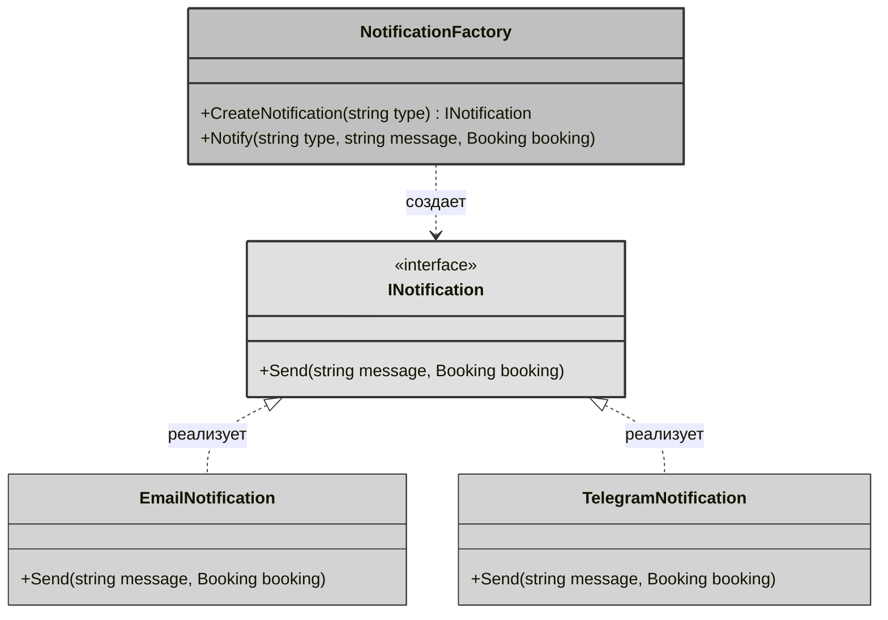
```mermaid
classDiagram
    class INotification {
        <<interface>>
        +Send(string message, Booking booking)
    }
    
    class EmailNotification {
        +Send(string message, Booking booking)
    }
    
    class TelegramNotification {
        +Send(string message, Booking booking)
    }
    
    class NotificationFactory {
        +CreateNotification(string type) INotification
        +Notify(string type, string message, Booking booking)
    }
    
    INotification <|.. EmailNotification : реализует
    INotification <|.. TelegramNotification : реализует
    
    NotificationFactory ..> INotification : создает
    
    style INotification fill:#e0e0e0,stroke:#333,stroke-width:2px
    style EmailNotification fill:#d3d3d3,stroke:#333,stroke-width:1px
    style TelegramNotification fill:#d3d3d3,stroke:#333,stroke-width:1px
    style NotificationFactory fill:#c0c0c0,stroke:#333,stroke-width:2px
```

**Описание диаграммы:**
- **INotification** интерфейс, определяющий контракт для всех типов уведомлений
- **EmailNotification** и **TelegramNotification** конкретные реализации уведомлений
- **NotificationFactory** фабрика с фабричным методом CreateNotification(), который создает нужный тип уведомления в зависимости от параметра type

#### Фрагмент программного кода

**Интерфейс INotification:**
```csharp
public interface INotification
{
    void Send(string message, Booking booking);
}
```

**Конкретные классы уведомлений:**
```csharp
public class EmailNotification : INotification
{
    public void Send(string message, Booking booking)
    {
        if (string.IsNullOrEmpty(booking.Email))
        {
            Console.WriteLine("Email не указан");
            return;
        }
        
        Console.WriteLine($" EMAIL отправлен на {booking.Email}");
        Console.WriteLine($"   Тема: {booking.Topic}");
        Console.WriteLine($"   Сообщение: {message}");
        Console.WriteLine($"   Студент: {booking.StudentName}");
    }
}

public class TelegramNotification : INotification
{
    public void Send(string message, Booking booking)
    {
        if (string.IsNullOrEmpty(booking.TelegramId))
        {
            Console.WriteLine("Telegram ID не указан");
            return;
        }
        
        Console.WriteLine($" TELEGRAM отправлено пользователю {booking.TelegramId}");
        Console.WriteLine($"   Сообщение: {message}");
        Console.WriteLine($"   Студент: {booking.StudentName}");
        Console.WriteLine($"   Тема: {booking.Topic}");
    }
}
```

**Фабрика с фабричным методом:**
```csharp
public class NotificationFactory
{
    // Фабричный метод - создает нужный тип уведомления
    public INotification CreateNotification(string type)
    {
        return type.ToLower() switch
        {
            "email" => new EmailNotification(),
            "telegram" => new TelegramNotification(),
            _ => throw new ArgumentException($"Неизвестный тип уведомления. Доступны: email, telegram")
        };
    }
    
    // Удобный метод для отправки уведомления
    public void Notify(string type, string message, Booking booking)
    {
        var notification = CreateNotification(type);
        notification.Send(message, booking);
    }
}
```

**Использование в контроллере:**
```csharp
[HttpPost("send-test")]
public IActionResult SendTestNotification([FromQuery] string type)
{
    try
    {
        var booking = new Booking
        {
            Id = Guid.NewGuid().ToString(),
            StudentName = "Тестовый Студент",
            Email = "test@mail.com",
            TelegramId = "@test",
            Topic = "Тестовая консультация"
        };
        
        var factory = new NotificationFactory();
        factory.Notify(type, "Напоминание о консультации", booking);
        
        return Ok(new 
        { 
            success = true, 
            message = $"Уведомление типа '{type}' отправлено",
            bookingId = booking.Id
        });
    }
    catch (Exception ex)
    {
        return BadRequest(new { success = false, error = ex.Message });
    }
}
```

### 2. Builder (Строитель)

#### Общее назначение
Строитель — это порождающий паттерн проектирования, который позволяет создавать сложные объекты пошагово. В отличие от других порождающих паттернов, Строитель позволяет производить различные представления объекта, используя один и тот же процесс конструирования.

#### Назначение в проекте 
В системе используется для создания объекта `Booking` (бронирование), который имеет множество полей, включая обязательные и опциональные. Паттерн позволяет:
- Пошагово заполнять информацию о бронировании
- Делать код более читаемым при создании сложных объектов
- Создавать разные варианты бронирования (с контактами или без, с заметками и т.д.)

#### UML-диаграмма

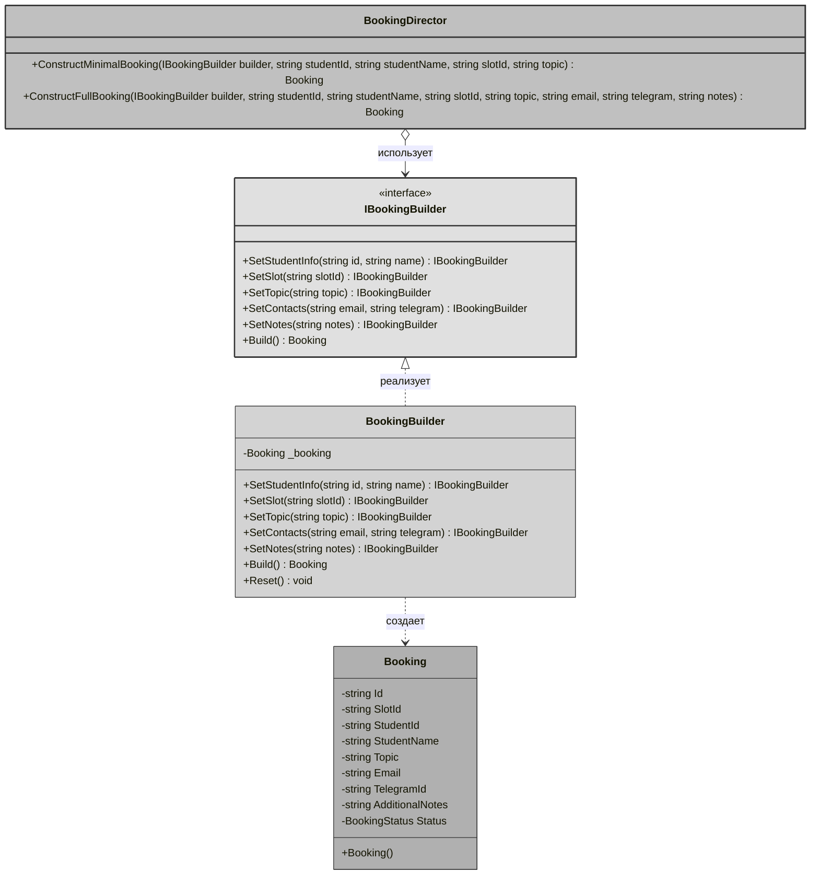
```mermaid
classDiagram
    class Booking {
        -string Id
        -string SlotId
        -string StudentId
        -string StudentName
        -string Topic
        -string Email
        -string TelegramId
        -string AdditionalNotes
        -BookingStatus Status
        +Booking()
    }
    
    class IBookingBuilder {
        <<interface>>
        +SetStudentInfo(string id, string name) IBookingBuilder
        +SetSlot(string slotId) IBookingBuilder
        +SetTopic(string topic) IBookingBuilder
        +SetContacts(string email, string telegram) IBookingBuilder
        +SetNotes(string notes) IBookingBuilder
        +Build() Booking
    }
    
    class BookingBuilder {
        -Booking _booking
        +SetStudentInfo(string id, string name) IBookingBuilder
        +SetSlot(string slotId) IBookingBuilder
        +SetTopic(string topic) IBookingBuilder
        +SetContacts(string email, string telegram) IBookingBuilder
        +SetNotes(string notes) IBookingBuilder
        +Build() Booking
        +Reset() void
    }
    
    class BookingDirector {
        +ConstructMinimalBooking(IBookingBuilder builder, string studentId, string studentName, string slotId, string topic) Booking
        +ConstructFullBooking(IBookingBuilder builder, string studentId, string studentName, string slotId, string topic, string email, string telegram, string notes) Booking
    }
    
    IBookingBuilder <|.. BookingBuilder : реализует
    BookingBuilder ..> Booking : создает
    BookingDirector o--> IBookingBuilder : использует
    
    style IBookingBuilder fill:#e0e0e0,stroke:#333,stroke-width:2px
    style BookingBuilder fill:#d3d3d3,stroke:#333,stroke-width:1px
    style Booking fill:#b0b0b0,stroke:#333,stroke-width:1px
    style BookingDirector fill:#c0c0c0,stroke:#333,stroke-width:2px
```

**Описание диаграммы:**
- **IBookingBuilder** интерфейс строителя, определяющий шаги создания объекта
- **BookingBuilder** конкретная реализация строителя для создания бронирований
- **Booking** продукт, который создается строителем
- **BookingDirector** директор, который управляет процессом создания (опционально)

#### Фрагмент программного кода

**Интерфейс строителя:**
```csharp
public interface IBookingBuilder
{
    IBookingBuilder SetStudentInfo(string id, string name);
    IBookingBuilder SetSlot(string slotId);
    IBookingBuilder SetTopic(string topic);
    IBookingBuilder SetContacts(string? email, string? telegramId);
    IBookingBuilder SetNotes(string? notes);
    Booking Build();
}
```

**Конкретный строитель:**
```csharp
public class BookingBuilder : IBookingBuilder
{
    private Booking _booking;
    
    public BookingBuilder()
    {
        Reset();
    }
    
    private void Reset()
    {
        _booking = new Booking
        {
            Id = Guid.NewGuid().ToString(),
            Status = BookingStatus.Pending,
            CreatedAt = DateTime.UtcNow
        };
    }
    
    public IBookingBuilder SetStudentInfo(string id, string name)
    {
        _booking.StudentId = id;
        _booking.StudentName = name;
        return this;
    }
    
    public IBookingBuilder SetSlot(string slotId)
    {
        _booking.SlotId = slotId;
        return this;
    }
    
    public IBookingBuilder SetTopic(string topic)
    {
        _booking.Topic = topic;
        return this;
    }
    
    public IBookingBuilder SetContacts(string? email, string? telegramId)
    {
        _booking.Email = email;
        _booking.TelegramId = telegramId;
        return this;
    }
    
    public IBookingBuilder SetNotes(string? notes)
    {
        _booking.AdditionalNotes = notes;
        return this;
    }
    
    public Booking Build()
    {
        // Валидация обязательных полей
        if (string.IsNullOrEmpty(_booking.StudentId))
            throw new InvalidOperationException("StudentId is required");
            
        if (string.IsNullOrEmpty(_booking.SlotId))
            throw new InvalidOperationException("SlotId is required");
            
        if (string.IsNullOrEmpty(_booking.Topic))
            throw new InvalidOperationException("Topic is required");
        
        var result = _booking;
        Reset(); // Сбрасываем для следующего использования
        return result;
    }
}
```

**Директор:**
```csharp
public class BookingDirector
{
    // Создание минимального бронирования (только обязательные поля)
    public Booking ConstructMinimalBooking(
        IBookingBuilder builder, 
        string studentId, 
        string studentName, 
        string slotId, 
        string topic)
    {
        return builder
            .SetStudentInfo(studentId, studentName)
            .SetSlot(slotId)
            .SetTopic(topic)
            .Build();
    }
    
    // Создание полного бронирования (со всеми контактами)
    public Booking ConstructFullBooking(
        IBookingBuilder builder,
        string studentId,
        string studentName,
        string slotId,
        string topic,
        string? email,
        string? telegramId,
        string? notes)
    {
        return builder
            .SetStudentInfo(studentId, studentName)
            .SetSlot(slotId)
            .SetTopic(topic)
            .SetContacts(email, telegramId)
            .SetNotes(notes)
            .Build();
    }
}
```

**Использование в контроллере:**
```csharp
[HttpPost("create-with-builder")]
public async Task<IActionResult> CreateBookingWithBuilder([FromBody] CreateBookingRequest request)
{
    try
    {
        // Проверяем существование слота
        var slot = await _context.Slots.FirstOrDefaultAsync(s => s.Id == request.SlotId);
        if (slot == null)
            return NotFound("Слот не найден");
            
        if (slot.Status != SlotStatus.Free)
            return BadRequest("Слот уже занят");
        
        // Используем Builder для создания бронирования
        var builder = new BookingBuilder();
        
        var booking = builder
            .SetStudentInfo(request.StudentId, request.StudentName)
            .SetSlot(request.SlotId)
            .SetTopic(request.Topic)
            .SetContacts(request.Email, request.TelegramId)
            .SetNotes(request.AdditionalNotes)
            .Build();
        
        // Обновляем статус слота
        slot.Status = SlotStatus.Pending;
        
        // Сохраняем в БД
        _context.Bookings.Add(booking);
        await _context.SaveChangesAsync();
        
        // Отправляем уведомление через фабрику
        if (!string.IsNullOrEmpty(booking.Email))
        {
            var notificationFactory = new NotificationFactory();
            notificationFactory.Notify("email", "Ваша заявка на консультацию получена", booking);
        }
        
        return Ok(new CreateBookingResponse
        {
            BookingId = booking.Id,
            Status = booking.Status,
            SlotId = booking.SlotId,
            StudentId = booking.StudentId,
            Topic = booking.Topic,
            CreatedAt = booking.CreatedAt
        });
    }
    catch (InvalidOperationException ex)
    {
        return BadRequest(ex.Message);
    }
    catch (Exception ex)
    {
        _logger.LogError(ex, "Ошибка при создании бронирования");
        return StatusCode(500, "Внутренняя ошибка сервера");
    }
}
```

**Использование директора для стандартных сценариев:**
```csharp
[HttpPost("quick-booking")]
public async Task<IActionResult> QuickBooking(string studentId, string slotId)
{
    // Быстрое создание бронирования с минимальными данными
    var director = new BookingDirector();
    var builder = new BookingBuilder();
    
    var booking = director.ConstructMinimalBooking(
        builder, 
        studentId, 
        "Студент",
        slotId, 
        "Консультация"
    );
    return Ok(booking);
}
```
### 3. Singleton (Одиночка)

#### Общее назначение
Одиночка — это порождающий паттерн проектирования, который гарантирует, что у класса есть только один экземпляр, и предоставляет глобальную точку доступа к этому экземпляру. Ключевая особенность - класс содержит статическую ссылку на самого себя, а конструктор делается приватным, чтобы предотвратить создание объектов извне.

#### Назначение в проекте "Система управления консультациями"
В системе используется для создания единого логгера, который записывает все действия в системе:
- Создание бронирований
- Отправку уведомлений
- Ошибки и предупреждения
- Информационные сообщения

Это гарантирует, что все компоненты системы пишут в один и тот же файл лога, и нет конфликтов при одновременной записи из разных частей приложения.

#### UML-диаграмма

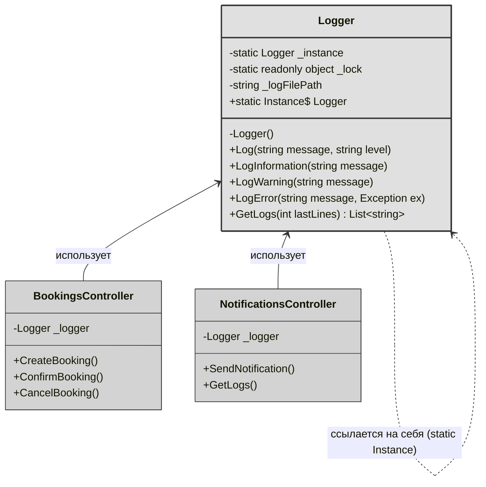
```mermaid
classDiagram
    class Logger {
        -static Logger _instance
        -static readonly object _lock
        -string _logFilePath
        -Logger()
        +static Instance$ Logger
        +Log(string message, string level)
        +LogInformation(string message)
        +LogWarning(string message)
        +LogError(string message, Exception ex)
        +GetLogs(int lastLines) List~string~
    }
    
    class BookingsController {
        -Logger _logger
        +CreateBooking()
        +ConfirmBooking()
        +CancelBooking()
    }
    
    class NotificationsController {
        -Logger _logger
        +SendNotification()
        +GetLogs()
    }
    
    Logger <-- BookingsController : использует
    Logger <-- NotificationsController : использует
    
    Logger ..> Logger : ссылается на себя (static Instance)
    
    style Logger fill:#e0e0e0,stroke:#333,stroke-width:2px
    style BookingsController fill:#d3d3d3,stroke:#333,stroke-width:1px
    style NotificationsController fill:#d3d3d3,stroke:#333,stroke-width:1px
```

**Описание диаграммы:**
- **Logger** класс-одиночка с приватным конструктором и статической ссылкой на самого себя (`_instance`)
- Стрелка от Logger к самой себе показывает, что класс хранит ссылку на собственный экземпляр
- **BookingsController** и **NotificationsController** используют единый экземпляр логгера через статическое свойство `Instance`
- Все обращения из разных контроллеров ведут к одному и тому же объекту

#### Фрагмент программного кода

**Класс-одиночка Logger:**

```csharp
using System;
using System.Collections.Generic;
using System.IO;

namespace ConsultationAPI.Services
{
    public class Logger
    {
        // Статическая переменная для хранения единственного экземпляра (ссылка на самого себя)
        private static Logger? _instance;
        
        // Объект для потокобезопасности
        private static readonly object _lock = new object();
        
        // Путь к файлу лога
        private readonly string _logFilePath;
        
        // Приватный конструктор - предотвращает создание экземпляров извне
        private Logger()
        {
            _logFilePath = "logs.txt";
            
            // Создаем директорию для логов, если её нет
            var logDirectory = Path.GetDirectoryName(_logFilePath);
            if (!string.IsNullOrEmpty(logDirectory) && !Directory.Exists(logDirectory))
            {
                Directory.CreateDirectory(logDirectory);
            }
            
            // Записываем начало сессии
            Log("Сессия запущена", "INFO");
        }
        
        // Публичное статическое свойство для доступа к экземпляру
        public static Logger Instance
        {
            get
            {
                // Потокобезопасная инициализация (ленивая загрузка)
                lock (_lock)
                {
                    if (_instance == null)
                    {
                        _instance = new Logger(); // Создаем экземпляр самого себя
                    }
                    return _instance;
                }
            }
        }
        
        // Базовый метод логирования
        public void Log(string message, string level = "INFO")
        {
            var logEntry = $"[{DateTime.Now:yyyy-MM-dd HH:mm:ss}] [{level}] {message}";
            
            // Выводим в консоль
            Console.WriteLine(logEntry);
            
            // Записываем в файл
            lock (_lock)
            {
                File.AppendAllText(_logFilePath, logEntry + Environment.NewLine);
            }
        }
        
        // Удобные методы для разных уровней логирования
        public void LogInformation(string message)
        {
            Log(message, "INFO");
        }
        
        public void LogWarning(string message)
        {
            Log(message, "WARNING");
        }
        
        public void LogError(string message, Exception? ex = null)
        {
            Log($"{message}. Ошибка: {ex?.Message}", "ERROR");
            if (ex?.StackTrace != null)
            {
                Log($"Stack Trace: {ex.StackTrace}", "ERROR");
            }
        }

        public List<string> GetLogs(int lastLines = 100)
        {
            lock (_lock)
            {
                if (!File.Exists(_logFilePath))
                    return new List<string>();
                    
                return File.ReadLines(_logFilePath)
                    .Reverse()
                    .Take(lastLines)
                    .Reverse()
                    .ToList();
            }
        }
    }
}
```

### 4. Adapter (Адаптер)

#### Общее назначение
Адаптер — это структурный паттерн проектирования, который позволяет объектам с несовместимыми интерфейсами работать вместе. Он выступает в роли моста, преобразуя вызовы одного интерфейса в вызовы другого, не изменяя их исходный код.

#### Назначение в проекте "Система управления консультациями"
В системе существует единый интерфейс `INotification` для отправки уведомлений. В данный момент все уведомления отправляются через Telegram с помощью класса `TelegramNotification`. Однако в будущем может потребоваться интеграция с другим мессенджером, например **MaxMessenger**, который имеет несовместимый интерфейс (метод `SendMaxMessage` с другими параметрами). Паттерн Adapter позволяет создать класс-адаптер, который приведёт интерфейс MaxMessenger к стандарту `INotification`, не меняя код ни существующей системы, ни самого MaxMessenger. На данный момент адаптер написан и хранится в проекте "про запас", готовый к использованию при необходимости.

#### UML-диаграмма

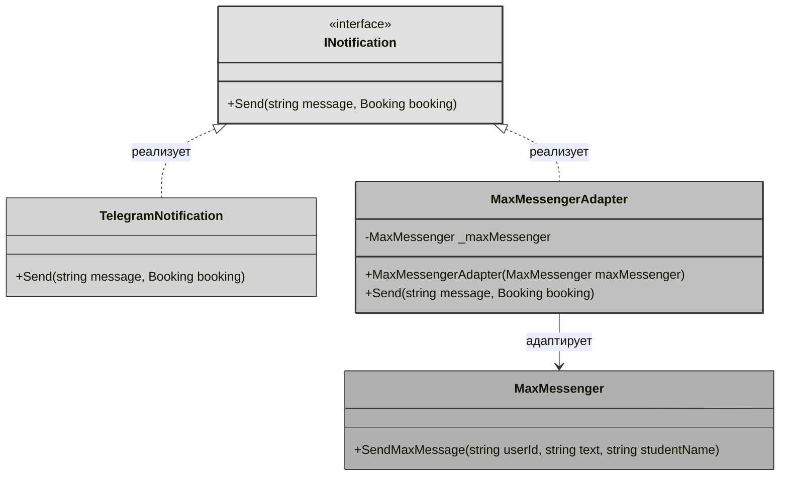
```mermaid
classDiagram
    class INotification {
        <<interface>>
        +Send(string message, Booking booking)
    }
    
    class TelegramNotification {
        +Send(string message, Booking booking)
    }
    
    class MaxMessenger {
        +SendMaxMessage(string userId, string text, string studentName)
    }
    
    class MaxMessengerAdapter {
        -MaxMessenger _maxMessenger
        +MaxMessengerAdapter(MaxMessenger maxMessenger)
        +Send(string message, Booking booking)
    }
    
    INotification <|.. TelegramNotification : реализует
    INotification <|.. MaxMessengerAdapter : реализует
    MaxMessengerAdapter --> MaxMessenger : адаптирует
    
    style INotification fill:#e0e0e0,stroke:#333,stroke-width:2px
    style TelegramNotification fill:#d3d3d3,stroke:#333,stroke-width:1px
    style MaxMessenger fill:#b0b0b0,stroke:#333,stroke-width:1px
    style MaxMessengerAdapter fill:#c0c0c0,stroke:#333,stroke-width:2px
```

**Описание диаграммы:**
- **INotification** целевой интерфейс, используемый в системе.
- **TelegramNotification** существующая реализация, работающая напрямую.
- **MaxMessenger** внешний класс с несовместимым интерфейсом (Adaptee).
- **MaxMessengerAdapter** адаптер, реализующий интерфейс `INotification` и перенаправляющий вызовы к `MaxMessenger` с преобразованием параметров.

#### Фрагмент программного кода

**Интерфейс INotification (целевой интерфейс):**
```csharp
public interface INotification
{
    void Send(string message, Booking booking);
}
```

**Существующая реализация для Telegram:**
```csharp
public class TelegramNotification : INotification
{
    public void Send(string message, Booking booking)
    {
        if (string.IsNullOrEmpty(booking.TelegramId))
        {
            Console.WriteLine("Telegram ID не указан, уведомление не отправлено");
            return;
        }
        
        Console.WriteLine($" TELEGRAM отправлено пользователю {booking.TelegramId}");
        Console.WriteLine($"   Сообщение: {message}");
        Console.WriteLine($"   Студент: {booking.StudentName}");
    }
}
```

**Внешний класс с несовместимым интерфейсом (Adaptee):**
```csharp
public class MaxMessenger
{
    public void SendMaxMessage(string userId, string text, string studentName)
    {
        Console.WriteLine($" MAX MESSENGER -> {userId}");
        Console.WriteLine($"   Сообщение: {text}");
        Console.WriteLine($"   Студент: {studentName}");
        Console.WriteLine($"   Отправлено через MaxMessenger");
    }
}
```

**Адаптер, приводящий интерфейс MaxMessenger к INotification:**
```csharp
public class MaxMessengerAdapter : INotification
{
    private readonly MaxMessenger _maxMessenger;
    
    public MaxMessengerAdapter(MaxMessenger maxMessenger)
    {
        _maxMessenger = maxMessenger;
    }
    
    public void Send(string message, Booking booking)
    {
        // Преобразуем данные из Booking в параметры для MaxMessenger
        string userId = booking.TelegramId ?? "unknown_user";
        string studentName = booking.StudentName;
        
        _maxMessenger.SendMaxMessage(userId, message, studentName);
    }
}
```
### 5. Decorator (Декоратор)

#### Общее назначение
Декоратор — это структурный паттерн, который позволяет динамически добавлять объектам новую функциональность, оборачивая их в полезные «обёртки». Декоратор предоставляет гибкую альтернативу созданию подклассов для расширения функциональности.

#### Назначение в проекте 
В системе есть базовые уведомления (Email, Telegram). Иногда требуется дополнительная функциональность: шифрование сообщений или автоматические повторные попытки при ошибках. Паттерн Decorator позволяет «обернуть» базовое уведомление в декораторы, добавляющие такое поведение, без изменения кода самих уведомлений.

#### UML-диаграмма

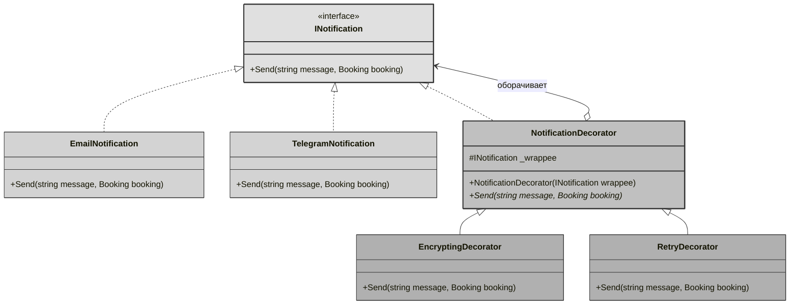
```mermaid
classDiagram
    class INotification {
        <<interface>>
        +Send(string message, Booking booking)
    }

    class EmailNotification {
        +Send(string message, Booking booking)
    }

    class TelegramNotification {
        +Send(string message, Booking booking)
    }

    class NotificationDecorator {
        #INotification _wrappee
        +NotificationDecorator(INotification wrappee)
        +Send(string message, Booking booking)*
    }

    class EncryptingDecorator {
        +Send(string message, Booking booking)
    }

    class RetryDecorator {
        +Send(string message, Booking booking)
    }

    INotification <|.. EmailNotification
    INotification <|.. TelegramNotification
    INotification <|.. NotificationDecorator
    NotificationDecorator <|-- EncryptingDecorator
    NotificationDecorator <|-- RetryDecorator
    NotificationDecorator o--> INotification : оборачивает

    style INotification fill:#e0e0e0,stroke:#333,stroke-width:2px
    style EmailNotification fill:#d3d3d3,stroke:#333,stroke-width:1px
    style TelegramNotification fill:#d3d3d3,stroke:#333,stroke-width:1px
    style NotificationDecorator fill:#c0c0c0,stroke:#333,stroke-width:2px
    style EncryptingDecorator fill:#b0b0b0,stroke:#333,stroke-width:1px
    style RetryDecorator fill:#b0b0b0,stroke:#333,stroke-width:1px
```

**Описание диаграммы:**
- **INotification** общий интерфейс для всех уведомлений.
- **EmailNotification**, **TelegramNotification** конкретные компоненты, реализующие базовую функциональность.
- **NotificationDecorator** абстрактный декоратор, хранит ссылку на оборачиваемый объект и делегирует ему выполнение.
- **EncryptingDecorator**, **RetryDecorator** конкретные декораторы, добавляющие своё поведение до/после вызова обёрнутого объекта.

#### Фрагмент программного кода

**Базовый интерфейс и компоненты:**
```csharp
public interface INotification
{
    void Send(string message, Booking booking);
}

public class TelegramNotification : INotification
{
    public void Send(string message, Booking booking)
    {
        Console.WriteLine($"TELEGRAM: {booking.TelegramId} - {message}");
    }
}

public class EmailNotification : INotification
{
    public void Send(string message, Booking booking)
    {
        Console.WriteLine($"EMAIL: {booking.Email} - {message}");
    }
}
```

**Абстрактный декоратор:**
```csharp
public abstract class NotificationDecorator : INotification
{
    protected INotification _wrappee;

    public NotificationDecorator(INotification wrappee)
    {
        _wrappee = wrappee;
    }

    public virtual void Send(string message, Booking booking)
    {
        _wrappee.Send(message, booking);
    }
}
```

**Декоратор шифрования:**
```csharp
public class EncryptingDecorator : NotificationDecorator
{
    public EncryptingDecorator(INotification wrappee) : base(wrappee) { }

    public override void Send(string message, Booking booking)
    {
        string encrypted = $"ENCRYPTED[{message}]";
        Console.WriteLine("Сообщение зашифровано");
        base.Send(encrypted, booking);
    }
}
```

**Декоратор повторных попыток:**
```csharp
public class RetryDecorator : NotificationDecorator
{
    private readonly int _maxRetries;

    public RetryDecorator(INotification wrappee, int maxRetries = 3) : base(wrappee)
    {
        _maxRetries = maxRetries;
    }

    public override void Send(string message, Booking booking)
    {
        int attempt = 0;
        bool sent = false;
        
        while (!sent && attempt < _maxRetries)
        {
            try
            {
                attempt++;
                Console.WriteLine($"Попытка отправки #{attempt}");
                
                base.Send(message, booking);
                
                sent = true;
                Console.WriteLine("Отправлено успешно");
            }
            catch (Exception ex)
            {
                Console.WriteLine($"Ошибка: {ex.Message}");
                
                if (attempt >= _maxRetries)
                {
                    Console.WriteLine("Все попытки исчерпаны");
                    throw;
                }
                
                Console.WriteLine("Повтор через 1 секунду...");
                Thread.Sleep(1000);
            }
        }
    }
}
```
### 6. Proxy (Заместитель)

#### Общее назначение
Proxy — это структурный паттерн, который предоставляет объект-заместитель, контролирующий доступ к другому объекту. Заместитель имеет тот же интерфейс, что и реальный объект, поэтому для клиента нет разницы — он работает с заместителем или с реальным объектом.

#### Назначение в проекте "Система управления консультациями"
В системе часто выполняются запросы к базе данных для получения списка свободных слотов. Если слоты обновляются нечасто, можно использовать Proxy для кэширования результатов. Это уменьшит количество обращений к базе данных и ускорит ответы системы.

#### UML-диаграмма

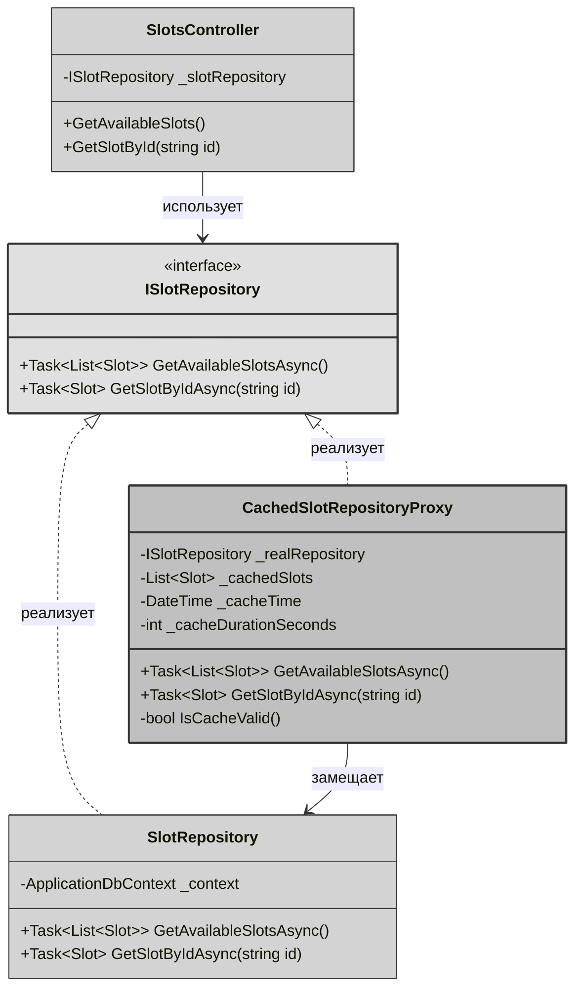
```mermaid
classDiagram
    class ISlotRepository {
        <<interface>>
        +Task~List~Slot~~ GetAvailableSlotsAsync()
        +Task~Slot~ GetSlotByIdAsync(string id)
    }

    class SlotRepository {
        -ApplicationDbContext _context
        +Task~List~Slot~~ GetAvailableSlotsAsync()
        +Task~Slot~ GetSlotByIdAsync(string id)
    }

    class CachedSlotRepositoryProxy {
        -ISlotRepository _realRepository
        -List~Slot~ _cachedSlots
        -DateTime _cacheTime
        -int _cacheDurationSeconds
        +Task~List~Slot~~ GetAvailableSlotsAsync()
        +Task~Slot~ GetSlotByIdAsync(string id)
        -bool IsCacheValid()
    }

    class SlotsController {
        -ISlotRepository _slotRepository
        +GetAvailableSlots()
        +GetSlotById(string id)
    }

    ISlotRepository <|.. SlotRepository : реализует
    ISlotRepository <|.. CachedSlotRepositoryProxy : реализует
    CachedSlotRepositoryProxy --> SlotRepository : замещает
    SlotsController --> ISlotRepository : использует

    style ISlotRepository fill:#e0e0e0,stroke:#333,stroke-width:2px
    style SlotRepository fill:#d3d3d3,stroke:#333,stroke-width:1px
    style CachedSlotRepositoryProxy fill:#c0c0c0,stroke:#333,stroke-width:2px
    style SlotsController fill:#d3d3d3,stroke:#333,stroke-width:1px
```

**Описание диаграммы:**
- **ISlotRepository** общий интерфейс для работы со слотами
- **SlotRepository** реальный объект, работающий с базой данных
- **CachedSlotRepositoryProxy** заместитель с кэшированием
- **SlotsController** клиент, который не знает, работает с реальным объектом или заместителем

#### Фрагмент программного кода

**Интерфейс репозитория:**

```csharp
using ConsultationAPI.Models;

namespace ConsultationAPI.Interfaces
{
    public interface ISlotRepository
    {
        Task<List<Slot>> GetAvailableSlotsAsync();
        Task<Slot?> GetSlotByIdAsync(string id);
    }
}
```

**Реальный объект (работает с БД):**

```csharp
using Microsoft.EntityFrameworkCore;
using ConsultationAPI.Models;
using ConsultationAPI.Enums;
using ConsultationAPI.Interfaces;
using ConsultationAPI.Data;

namespace ConsultationAPI.Repositories
{
    public class SlotRepository : ISlotRepository
    {
        private readonly ApplicationDbContext _context;
        
        public SlotRepository(ApplicationDbContext context)
        {
            _context = context;
        }
        
        public async Task<List<Slot>> GetAvailableSlotsAsync()
        {
            Console.WriteLine("Запрос к БД: получение свободных слотов");
            
            return await _context.Slots
                .Where(s => s.Status == SlotStatus.Free)
                .ToListAsync();
        }
        
        public async Task<Slot?> GetSlotByIdAsync(string id)
        {
            Console.WriteLine($"Запрос к БД: получение слота {id}");
            
            return await _context.Slots.FindAsync(id);
        }
    }
}
```

**Proxy с кэшированием:**

```csharp
using ConsultationAPI.Models;
using ConsultationAPI.Interfaces;

namespace ConsultationAPI.Proxies
{
    public class CachedSlotRepositoryProxy : ISlotRepository
    {
        private readonly ISlotRepository _realRepository;
        private List<Slot>? _cachedSlots;
        private DateTime _cacheTime;
        private readonly int _cacheDurationSeconds = 30; // Кэш на 30 секунд
        
        public CachedSlotRepositoryProxy(ISlotRepository realRepository)
        {
            _realRepository = realRepository;
        }
        
        public async Task<List<Slot>> GetAvailableSlotsAsync()
        {
            // Проверяем, есть ли валидный кэш
            if (IsCacheValid())
            {
                Console.WriteLine("Proxy: возврат данных из кэша");
                return _cachedSlots!;
            }
            
            // Кэша нет или он устарел - идём в реальный репозиторий
            Console.WriteLine("Proxy: кэш устарел, запрос к БД");
            _cachedSlots = await _realRepository.GetAvailableSlotsAsync();
            _cacheTime = DateTime.UtcNow;
            
            return _cachedSlots;
        }
        
        public async Task<Slot?> GetSlotByIdAsync(string id)
        {
            // Для запроса по ID всегда идём в БД (не кэшируем)
            Console.WriteLine("Proxy: запрос конкретного слота (без кэша)");
            return await _realRepository.GetSlotByIdAsync(id);
        }
        
        private bool IsCacheValid()
        {
            if (_cachedSlots == null)
                return false;
                
            var age = DateTime.UtcNow - _cacheTime;
            return age.TotalSeconds < _cacheDurationSeconds;
        }
    }
}
```

**Другой пример Proxy для логирования:**

```csharp
namespace ConsultationAPI.Proxies
{
    public class LoggingSlotRepositoryProxy : ISlotRepository
    {
        private readonly ISlotRepository _realRepository;
        private readonly ILogger<LoggingSlotRepositoryProxy> _logger;
        
        public LoggingSlotRepositoryProxy(ISlotRepository realRepository, ILogger<LoggingSlotRepositoryProxy> logger)
        {
            _realRepository = realRepository;
            _logger = logger;
        }
        
        public async Task<List<Slot>> GetAvailableSlotsAsync()
        {
            _logger.LogInformation($"Запрос свободных слотов в {DateTime.UtcNow}");
            
            var stopwatch = System.Diagnostics.Stopwatch.StartNew();
            var result = await _realRepository.GetAvailableSlotsAsync();
            stopwatch.Stop();
            
            _logger.LogInformation($"Получено {result.Count} слотов за {stopwatch.ElapsedMilliseconds} мс");
            
            return result;
        }
        
        public async Task<Slot?> GetSlotByIdAsync(string id)
        {
            _logger.LogInformation($"Запрос слота {id}");
            
            var result = await _realRepository.GetSlotByIdAsync(id);
            
            _logger.LogInformation(result == null ? $"Слот {id} не найден" : $"Слот {id} получен");
            
            return result;
        }
    }
}
```

**Контроллер, использующий Proxy:**

```csharp
using Microsoft.AspNetCore.Mvc;
using ConsultationAPI.Interfaces;
using ConsultationAPI.Proxies;

namespace ConsultationAPI.Controllers
{
    [ApiController]
    [Route("api/[controller]")]
    public class SlotsController : ControllerBase
    {
        private readonly ISlotRepository _slotRepository;
        
        // Контроллер даже не знает, работает он с реальным репозиторием или с Proxy!
        public SlotsController(ISlotRepository slotRepository)
        {
            _slotRepository = slotRepository;
        }
        
        [HttpGet("available")]
        public async Task<IActionResult> GetAvailableSlots()
        {
            var slots = await _slotRepository.GetAvailableSlotsAsync();
            return Ok(slots);
        }
        
        [HttpGet("{id}")]
        public async Task<IActionResult> GetSlotById(string id)
        {
            var slot = await _slotRepository.GetSlotByIdAsync(id);
            if (slot == null)
                return NotFound();
            return Ok(slot);
        }
    }
}
```

**Регистрация в Program.cs (с использованием Proxy):**

```csharp
// Реальный репозиторий
builder.Services.AddScoped<SlotRepository>();

// Регистрируем интерфейс с Proxy, который оборачивает реальный репозиторий
builder.Services.AddScoped<ISlotRepository>(serviceProvider =>
{
    var realRepository = serviceProvider.GetRequiredService<SlotRepository>();
    var logger = serviceProvider.GetRequiredService<ILogger<LoggingSlotRepositoryProxy>>();
    var loggingProxy = new LoggingSlotRepositoryProxy(realRepository, logger);
    var cachedProxy = new CachedSlotRepositoryProxy(loggingProxy);
    
    return cachedProxy; // Клиент получит Proxy с кэшированием и логированием
});
```
### 7. Composite (Компоновщик)

#### Общее назначение
Composite — это структурный паттерн, который позволяет сгруппировать объекты в древовидную структуру и работать с отдельными объектами и их группами одинаково. Клиентский код единообразно обращается и к простым, и к составным объектам.

#### Назначение в проекте "Система управления консультациями"
В системе консультаций у преподавателя может быть несколько слотов, а у слота — несколько бронирований (например, групповые консультации). Composite позволяет работать с отдельным слотом и группой слотов преподавателя через единый интерфейс, например, для отображения расписания или подсчёта занятости.

#### UML-диаграмма

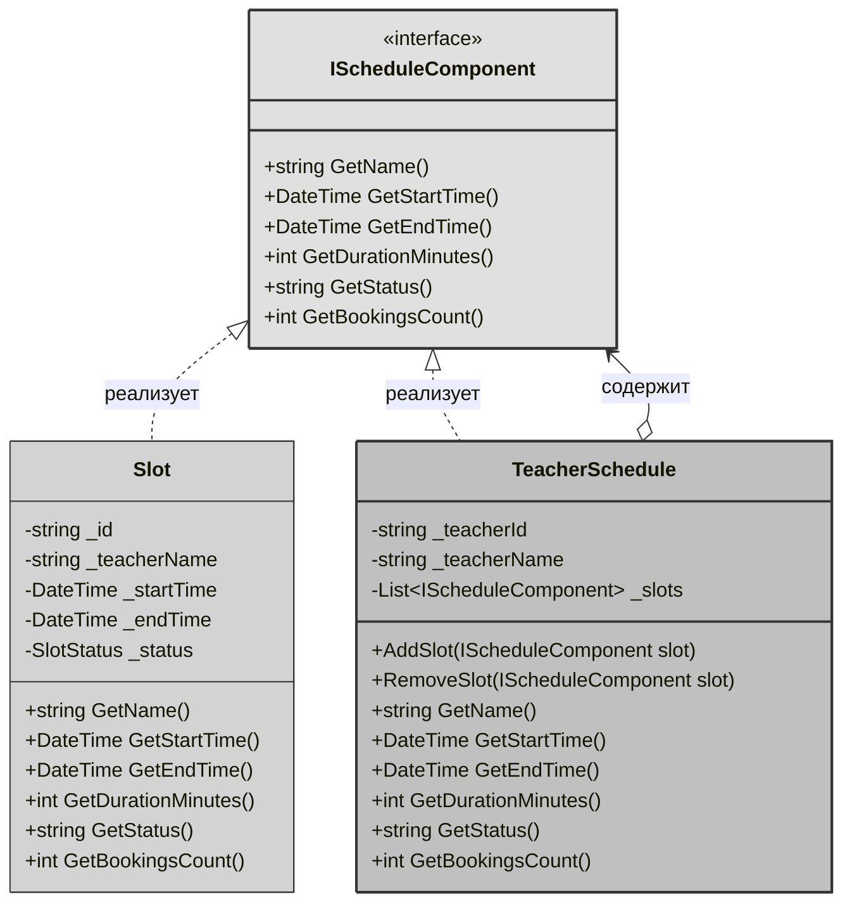
```mermaid
classDiagram
    class IScheduleComponent {
        <<interface>>
        +string GetName()
        +DateTime GetStartTime()
        +DateTime GetEndTime()
        +int GetDurationMinutes()
        +string GetStatus()
        +int GetBookingsCount()
    }

    class Slot {
        -string _id
        -string _teacherName
        -DateTime _startTime
        -DateTime _endTime
        -SlotStatus _status
        +string GetName()
        +DateTime GetStartTime()
        +DateTime GetEndTime()
        +int GetDurationMinutes()
        +string GetStatus()
        +int GetBookingsCount()
    }

    class TeacherSchedule {
        -string _teacherId
        -string _teacherName
        -List~IScheduleComponent~ _slots
        +AddSlot(IScheduleComponent slot)
        +RemoveSlot(IScheduleComponent slot)
        +string GetName()
        +DateTime GetStartTime()
        +DateTime GetEndTime()
        +int GetDurationMinutes()
        +string GetStatus()
        +int GetBookingsCount()
    }

    IScheduleComponent <|.. Slot : реализует
    IScheduleComponent <|.. TeacherSchedule : реализует
    TeacherSchedule o--> IScheduleComponent : содержит

    style IScheduleComponent fill:#e0e0e0,stroke:#333,stroke-width:2px
    style Slot fill:#d3d3d3,stroke:#333,stroke-width:1px
    style TeacherSchedule fill:#c0c0c0,stroke:#333,stroke-width:2px
```

**Описание диаграммы:**
- **IScheduleComponent** общий интерфейс для всех компонентов расписания (листьев и контейнеров)
- **Slot** листовой компонент (отдельный слот)
- **TeacherSchedule** составной компонент (содержит несколько слотов преподавателя)

#### Фрагмент программного кода

**Общий интерфейс:**

```csharp
namespace ConsultationAPI.Interfaces
{
    public interface IScheduleComponent
    {
        string GetName();
        DateTime GetStartTime();
        DateTime GetEndTime();
        int GetDurationMinutes();
        string GetStatus();
        int GetBookingsCount();
    }
}
```

**Листовой компонент (Slot):**

```csharp
using ConsultationAPI.Interfaces;
using ConsultationAPI.Models;
using ConsultationAPI.Enums;

namespace ConsultationAPI.Components
{
    public class SlotComponent : IScheduleComponent
    {
        private readonly Slot _slot;
        private readonly int _bookingsCount;
        
        public SlotComponent(Slot slot, int bookingsCount = 0)
        {
            _slot = slot;
            _bookingsCount = bookingsCount;
        }
        
        public string GetName()
        {
            return $"Слот: {_slot.TeacherName} - {_slot.Description ?? "Консультация"}";
        }
        
        public DateTime GetStartTime()
        {
            return _slot.StartTime;
        }
        
        public DateTime GetEndTime()
        {
            return _slot.EndTime;
        }
        
        public int GetDurationMinutes()
        {
            return (int)(_slot.EndTime - _slot.StartTime).TotalMinutes;
        }
        
        public string GetStatus()
        {
            return _slot.Status.ToString();
        }
        
        public int GetBookingsCount()
        {
            return _bookingsCount;
        }
    }
}
```

**Составной компонент (TeacherSchedule):**

```csharp
using ConsultationAPI.Interfaces;

namespace ConsultationAPI.Components
{
    public class TeacherScheduleComponent : IScheduleComponent
    {
        private readonly string _teacherId;
        private readonly string _teacherName;
        private readonly List<IScheduleComponent> _slots = new();
        
        public TeacherScheduleComponent(string teacherId, string teacherName)
        {
            _teacherId = teacherId;
            _teacherName = teacherName;
        }
        
        public void AddSlot(IScheduleComponent slot)
        {
            _slots.Add(slot);
        }
        
        public void RemoveSlot(IScheduleComponent slot)
        {
            _slots.Remove(slot);
        }
        
        public string GetName()
        {
            return $"Преподаватель: {_teacherName}";
        }
        
        public DateTime GetStartTime()
        {
            if (!_slots.Any())
                return DateTime.MaxValue;
                
            return _slots.Min(s => s.GetStartTime());
        }
        
        public DateTime GetEndTime()
        {
            if (!_slots.Any())
                return DateTime.MinValue;
                
            return _slots.Max(s => s.GetEndTime());
        }
        
        public int GetDurationMinutes()
        {
            // Общая длительность всех слотов преподавателя
            return _slots.Sum(s => s.GetDurationMinutes());
        }
        
        public string GetStatus()
        {
            int totalSlots = _slots.Count();
            int bookedSlots = _slots.Count(s => s.GetStatus() == "Booked");
            
            return $"Слотов: {totalSlots}, Занято: {bookedSlots}";
        }
        
        public int GetBookingsCount()
        {
            // Суммарное количество бронирований у преподавателя
            return _slots.Sum(s => s.GetBookingsCount());
        }
    }
}
### 8. Observer (Наблюдатель)

#### Общее назначение
Observer — это поведенческий паттерн, который создаёт механизм подписки, позволяющий одним объектам следить и реагировать на события, происходящие в других объектах.

#### Назначение в проекте "Система управления консультациями"
В системе консультаций есть объект `Booking` (бронирование), за изменениями которого нужно следить разным компонентам: логгеру (записывать изменения), сервису уведомлений (отправлять оповещения), календарю (обновлять расписание). Паттерн Observer позволяет автоматически уведомлять все заинтересованные объекты при изменении статуса бронирования.

#### UML-диаграмма

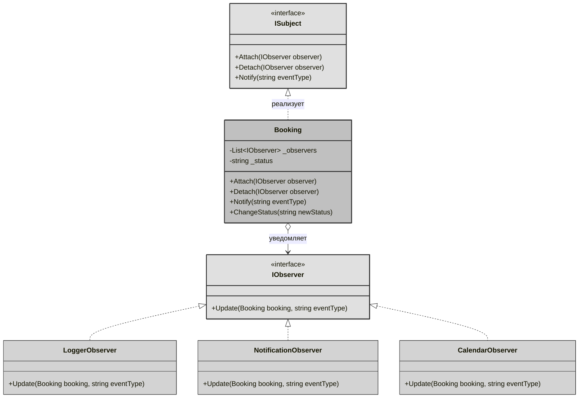
```mermaid
classDiagram
    class IObserver {
        <<interface>>
        +Update(Booking booking, string eventType)
    }

    class ISubject {
        <<interface>>
        +Attach(IObserver observer)
        +Detach(IObserver observer)
        +Notify(string eventType)
    }

    class Booking {
        -List~IObserver~ _observers
        -string _status
        +Attach(IObserver observer)
        +Detach(IObserver observer)
        +Notify(string eventType)
        +ChangeStatus(string newStatus)
    }

    class LoggerObserver {
        +Update(Booking booking, string eventType)
    }

    class NotificationObserver {
        +Update(Booking booking, string eventType)
    }

    class CalendarObserver {
        +Update(Booking booking, string eventType)
    }

    ISubject <|.. Booking : реализует
    IObserver <|.. LoggerObserver
    IObserver <|.. NotificationObserver
    IObserver <|.. CalendarObserver
    Booking o--> IObserver : уведомляет

    style ISubject fill:#e0e0e0,stroke:#333,stroke-width:2px
    style IObserver fill:#e0e0e0,stroke:#333,stroke-width:2px
    style Booking fill:#c0c0c0,stroke:#333,stroke-width:2px
    style LoggerObserver fill:#d3d3d3,stroke:#333,stroke-width:1px
    style NotificationObserver fill:#d3d3d3,stroke:#333,stroke-width:1px
    style CalendarObserver fill:#d3d3d3,stroke:#333,stroke-width:1px
```

**Описание диаграммы:**
- **ISubject** интерфейс субъекта (объекта за которым наблюдают)
- **IObserver** интерфейс наблюдателя
- **Booking** конкретный субъект (бронирование)
- **LoggerObserver**, **NotificationObserver**, **CalendarObserver** — конкретные наблюдатели

#### Фрагмент программного кода

**Интерфейсы:**

```csharp
using ConsultationAPI.Models;

namespace ConsultationAPI.Observers
{
    public interface IObserver
    {
        void Update(Booking booking, string eventType);
    }

    public interface ISubject
    {
        void Attach(IObserver observer);
        void Detach(IObserver observer);
        void Notify(string eventType);
    }
}
```

**Субъект (BookingObservable):**

```csharp
using ConsultationAPI.Models;
using ConsultationAPI.Observers;
using ConsultationAPI.Enums;

namespace ConsultationAPI.Models
{
    // Расширяем существующую модель Booking возможностью наблюдения
    public class BookingObservable : Booking, ISubject
    {
        private List<IObserver> _observers = new List<IObserver>();

        public void Attach(IObserver observer)
        {
            _observers.Add(observer);
            Console.WriteLine($"Наблюдатель {observer.GetType().Name} подписался на бронирование {Id}");
        }

        public void Detach(IObserver observer)
        {
            _observers.Remove(observer);
            Console.WriteLine($"Наблюдатель {observer.GetType().Name} отписался от бронирования {Id}");
        }

        public void Notify(string eventType)
        {
            foreach (var observer in _observers)
            {
                observer.Update(this, eventType);
            }
        }

        // Метод для изменения статуса с уведомлением
        public void ChangeStatus(BookingStatus newStatus)
        {
            var oldStatus = Status;
            Status = newStatus;
            
            Console.WriteLine($"Статус бронирования {Id} изменён: {oldStatus} -> {newStatus}");
            
            // Уведомляем всех наблюдателей
            Notify($"StatusChanged");
        }

        // Метод для подтверждения бронирования
        public void Confirm(string? teacherNotes = null, string? meetingLink = null)
        {
            TeacherNotes = teacherNotes;
            MeetingLink = meetingLink;
            ConfirmedAt = DateTime.UtcNow;
            
            ChangeStatus(BookingStatus.Confirmed);
        }

        // Метод для отмены бронирования
        public void Cancel(string cancelledBy, string? reason = null)
        {
            CancelledBy = cancelledBy;
            CancelledAt = DateTime.UtcNow;
            
            ChangeStatus(BookingStatus.Cancelled);
        }
    }
}
```

**Наблюдатели:**

```csharp
using ConsultationAPI.Models;
using ConsultationAPI.Observers;

namespace ConsultationAPI.Observers
{
    // Наблюдатель для логирования
    public class LoggerObserver : IObserver
    {
        private readonly string _logFile;

        public LoggerObserver(string logFile = "logs.txt")
        {
            _logFile = logFile;
        }

        public void Update(Booking booking, string eventType)
        {
            var logEntry = $"[{DateTime.UtcNow}] Событие: {eventType}, " +
                          $"Бронирование: {booking.Id}, Статус: {booking.Status}, " +
                          $"Студент: {booking.StudentName}";
            
            Console.WriteLine($"ЛОГГЕР: {logEntry}");
            
            // Здесь можно записать в файл
            File.AppendAllText(_logFile, logEntry + Environment.NewLine);
        }
    }
}

// Наблюдатель для отправки уведомлений
public class NotificationObserver : IObserver
{
    public void Update(Booking booking, string eventType)
    {
        if (eventType == "StatusChanged")
        {
            string message = booking.Status switch
            {
                BookingStatus.Confirmed => $"Ваша консультация подтверждена! Ссылка: {booking.MeetingLink ?? "будет позже"}",
                BookingStatus.Cancelled => $"Консультация отменена. Причина: {booking.CancelledBy}",
                BookingStatus.Pending => "Заявка на консультацию получена",
                _ => $"Статус изменён на {booking.Status}"
            };

            if (!string.IsNullOrEmpty(booking.Email))
            {
                Console.WriteLine($"УВЕДОМЛЕНИЕ: Email отправлен на {booking.Email}");
                Console.WriteLine($"Текст: {message}");
            }

            if (!string.IsNullOrEmpty(booking.TelegramId))
            {
                Console.WriteLine($"УВЕДОМЛЕНИЕ: Telegram отправлен пользователю {booking.TelegramId}");
                Console.WriteLine($"Текст: {message}");
            }
        }
    }
}

// Наблюдатель для обновления календаря
public class CalendarObserver : IObserver
{
    public void Update(Booking booking, string eventType)
    {
        if (eventType == "StatusChanged")
        {
            if (booking.Status == BookingStatus.Confirmed)
            {
                Console.WriteLine($"КАЛЕНДАРЬ: Событие добавлено в календарь");
                Console.WriteLine($"Название: Консультация с {booking.StudentName}");
                Console.WriteLine($"Тема: {booking.Topic}");
                Console.WriteLine($"Ссылка: {booking.MeetingLink ?? "Оффлайн"}");
            }
            else if (booking.Status == BookingStatus.Cancelled)
            {
                Console.WriteLine()
```
### 9. Command (Команда)

#### Общее назначение
Command — это поведенческий паттерн, который превращает запросы в объекты, позволяя передавать их как аргументы при вызове методов, ставить запросы в очередь, логировать их, а также поддерживать отмену операций.

#### Назначение в проекте "Система управления консультациями"
В системе консультаций есть различные операции: создание бронирования, подтверждение, отмена. Паттерн Command позволяет инкапсулировать каждую операцию в отдельный объект. Это даёт возможность:
- Сохранять историю всех операций
- Логировать все действия пользователей
- При необходимости отменять последнее действие

#### UML-диаграмма

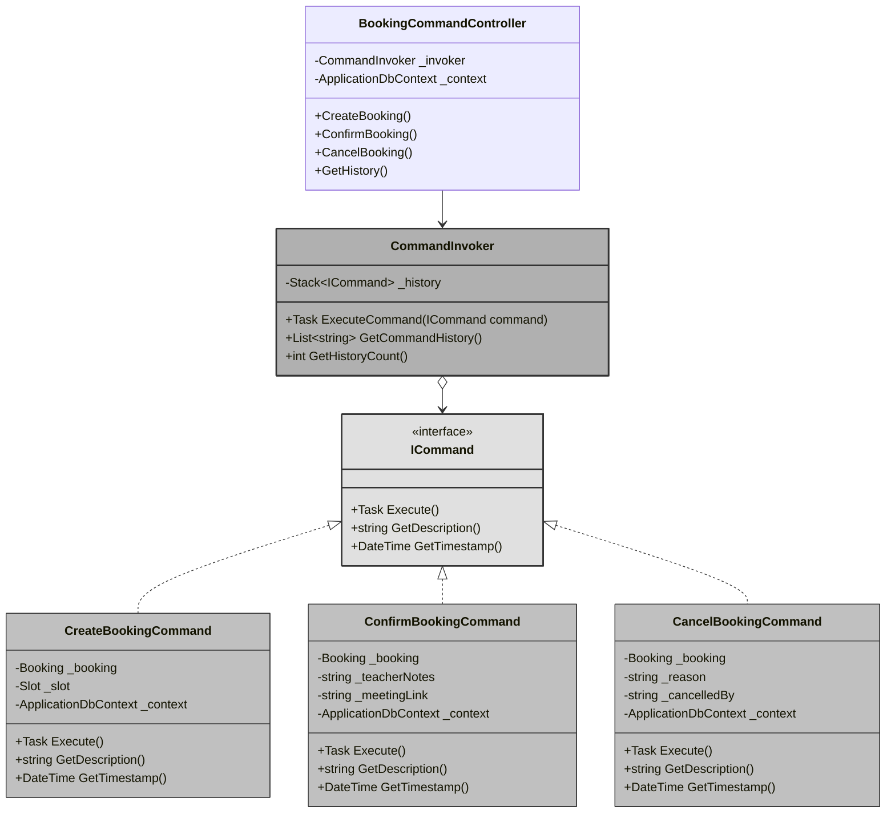
```mermaid
classDiagram
    class ICommand {
        <<interface>>
        +Task Execute()
        +string GetDescription()
        +DateTime GetTimestamp()
    }

    class CreateBookingCommand {
        -Booking _booking
        -Slot _slot
        -ApplicationDbContext _context
        +Task Execute()
        +string GetDescription()
        +DateTime GetTimestamp()
    }

    class ConfirmBookingCommand {
        -Booking _booking
        -string _teacherNotes
        -string _meetingLink
        -ApplicationDbContext _context
        +Task Execute()
        +string GetDescription()
        +DateTime GetTimestamp()
    }

    class CancelBookingCommand {
        -Booking _booking
        -string _reason
        -string _cancelledBy
        -ApplicationDbContext _context
        +Task Execute()
        +string GetDescription()
        +DateTime GetTimestamp()
    }

    class CommandInvoker {
        -Stack~ICommand~ _history
        +Task ExecuteCommand(ICommand command)
        +List~string~ GetCommandHistory()
        +int GetHistoryCount()
    }

    class BookingCommandController {
        -CommandInvoker _invoker
        -ApplicationDbContext _context
        +CreateBooking()
        +ConfirmBooking()
        +CancelBooking()
        +GetHistory()
    }

    ICommand <|.. CreateBookingCommand
    ICommand <|.. ConfirmBookingCommand
    ICommand <|.. CancelBookingCommand
    CommandInvoker o--> ICommand
    BookingCommandController --> CommandInvoker

    style ICommand fill:#e0e0e0,stroke:#333,stroke-width:2px
    style CreateBookingCommand fill:#c0c0c0,stroke:#333,stroke-width:1px
    style ConfirmBookingCommand fill:#c0c0c0,stroke:#333,stroke-width:1px
    style CancelBookingCommand fill:#c0c0c0,stroke:#333,stroke-width:1px
    style CommandInvoker fill:#b0b0b0,stroke:#333,stroke-width:2px
```

#### Фрагмент программного кода

**Интерфейс команды:**

```csharp
using ConsultationAPI.Models;

namespace ConsultationAPI.Commands
{
    public interface ICommand
    {
        Task Execute();
        string GetDescription();
        DateTime GetTimestamp();
    }
}
```

**Команда создания бронирования:**

```csharp
using ConsultationAPI.Models;
using ConsultationAPI.Data;
using ConsultationAPI.Enums;

namespace ConsultationAPI.Commands
{
    public class CreateBookingCommand : ICommand
    {
        private readonly Booking _booking;
        private readonly Slot _slot;
        private readonly ApplicationDbContext _context;
        private readonly DateTime _timestamp;

        public CreateBookingCommand(Booking booking, Slot slot, ApplicationDbContext context)
        {
            _booking = booking;
            _slot = slot;
            _context = context;
            _timestamp = DateTime.UtcNow;
        }

        public async Task Execute()
        {
            // Обновляем статус слота
            _slot.Status = SlotStatus.Pending;
            
            // Добавляем бронирование в БД
            _context.Bookings.Add(_booking);
            await _context.SaveChangesAsync();
            
            Console.WriteLine($"[КОМАНДА] Бронирование {_booking.Id} создано");
        }

        public string GetDescription()
        {
            return $"Создание бронирования для студента {_booking.StudentName} на тему '{_booking.Topic}'";
        }

        public DateTime GetTimestamp() => _timestamp;
    }
}
```

**Команда подтверждения бронирования:**

```csharp
using ConsultationAPI.Models;
using ConsultationAPI.Data;
using ConsultationAPI.Enums;

namespace ConsultationAPI.Commands
{
    public class ConfirmBookingCommand : ICommand
    {
        private readonly Booking _booking;
        private readonly string _teacherNotes;
        private readonly string _meetingLink;
        private readonly ApplicationDbContext _context;
        private readonly DateTime _timestamp;

        public ConfirmBookingCommand(Booking booking, string teacherNotes, string meetingLink, ApplicationDbContext context)
        {
            _booking = booking;
            _teacherNotes = teacherNotes;
            _meetingLink = meetingLink;
            _context = context;
            _timestamp = DateTime.UtcNow;
        }

        public async Task Execute()
        {
            _booking.Status = BookingStatus.Confirmed;
            _booking.ConfirmedAt = DateTime.UtcNow;
            _booking.TeacherNotes = _teacherNotes;
            _booking.MeetingLink = _meetingLink;

            var slot = await _context.Slots.FindAsync(_booking.SlotId);
            if (slot != null)
            {
                slot.Status = SlotStatus.Booked;
            }

            await _context.SaveChangesAsync();
            
            Console.WriteLine($"[КОМАНДА] Бронирование {_booking.Id} подтверждено");
        }

        public string GetDescription()
        {
            return $"Подтверждение бронирования для студента {_booking.StudentName}";
        }

        public DateTime GetTimestamp() => _timestamp;
    }
}
```

**Команда отмены бронирования:**

```csharp
using ConsultationAPI.Models;
using ConsultationAPI.Data;
using ConsultationAPI.Enums;

namespace ConsultationAPI.Commands
{
    public class CancelBookingCommand : ICommand
    {
        private readonly Booking _booking;
        private readonly string _reason;
        private readonly string _cancelledBy;
        private readonly ApplicationDbContext _context;
        private readonly DateTime _timestamp;

        public CancelBookingCommand(Booking booking, string cancelledBy, string reason, ApplicationDbContext context)
        {
            _booking = booking;
            _cancelledBy = cancelledBy;
            _reason = reason;
            _context = context;
            _timestamp = DateTime.UtcNow;
        }

        public async Task Execute()
        {
            _booking.Status = BookingStatus.Cancelled;
            _booking.CancelledAt = DateTime.UtcNow;
            _booking.CancelledBy = _cancelledBy;

            var slot = await _context.Slots.FindAsync(_booking.SlotId);
            if (slot != null)
            {
                slot.Status = SlotStatus.Free;
            }

            await _context.SaveChangesAsync();
            
            Console.WriteLine($"[КОМАНДА] Бронирование {_booking.Id} отменено. Причина: {_reason}");
        }

        public string GetDescription()
        {
            return $"Отмена бронирования для студента {_booking.StudentName}. Причина: {_reason}";
        }

        public DateTime GetTimestamp() => _timestamp;
    }
}
```

**Вызывающий объект (Invoker) - история:**

```csharp
using ConsultationAPI.Commands;

namespace ConsultationAPI.Invokers
{
    public class CommandInvoker
    {
        private readonly List<ICommand> _history = new List<ICommand>();

        public async Task ExecuteCommand(ICommand command)
        {
            await command.Execute();
            _history.Add(command);
            
            Console.WriteLine($"[INVOKER] Команда выполнена и добавлена в историю");
        }

        public List<string> GetCommandHistory()
        {
            var history = new List<string>();
            int index = 1;
            
            foreach (var command in _history)
            {
                history.Add($"{index++}. [{command.GetTimestamp():HH:mm:ss}] {command.GetDescription()}");
            }
            
            return history;
        }

        public int GetHistoryCount() => _history.Count;
        
        public void ClearHistory()
        {
            _history.Clear();
            Console.WriteLine($"[INVOKER] История очищена");
        }
    }
}
```

### 10. Chain of Responsibility (Цепочка обязанностей)

#### Общее назначение
Chain of Responsibility — это поведенческий паттерн, который позволяет передавать запросы последовательно по цепочке обработчиков. Каждый обработчик решает, может ли он обработать запрос, или нужно передать его дальше.

#### Назначение в проекте
Перед созданием бронирования нужно выполнить несколько проверок с реальными данными из БД:
- Проверка, существует ли слот
- Проверка, свободен ли слот
- Проверка, не создавал ли уже этот студент бронирование на этот слот

Каждая проверка — отдельный обработчик. Если проверка не пройдена, цепочка прерывается и возвращается ошибка.

#### UML-диаграмма

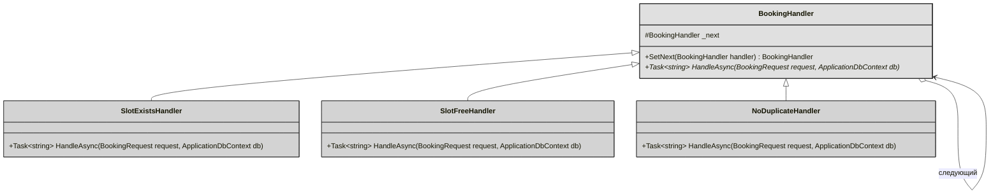
```mermaid
classDiagram
    class BookingHandler {
        #BookingHandler _next
        +SetNext(BookingHandler handler) BookingHandler
        +Task~string~ HandleAsync(BookingRequest request, ApplicationDbContext db)*
    }

    class SlotExistsHandler {
        +Task~string~ HandleAsync(BookingRequest request, ApplicationDbContext db)
    }

    class SlotFreeHandler {
        +Task~string~ HandleAsync(BookingRequest request, ApplicationDbContext db)
    }

    class NoDuplicateHandler {
        +Task~string~ HandleAsync(BookingRequest request, ApplicationDbContext db)
    }

    BookingHandler <|-- SlotExistsHandler
    BookingHandler <|-- SlotFreeHandler
    BookingHandler <|-- NoDuplicateHandler
    BookingHandler o--> BookingHandler : следующий

    style BookingHandler fill:#e0e0e0,stroke:#333,stroke-width:2px
    style SlotExistsHandler fill:#d3d3d3,stroke:#333,stroke-width:1px
    style SlotFreeHandler fill:#d3d3d3,stroke:#333,stroke-width:1px
    style NoDuplicateHandler fill:#d3d3d3,stroke:#333,stroke-width:1px
```

#### Фрагмент программного кода

**Модель запроса:**

```csharp
namespace ConsultationAPI.Models
{
    public class BookingRequest
    {
        public string SlotId { get; set; } = string.Empty;
        public string StudentId { get; set; } = string.Empty;
        public string StudentName { get; set; } = string.Empty;
        public string Topic { get; set; } = string.Empty;
        public string? Email { get; set; }
        public string? TelegramId { get; set; }
    }
}
```

**Базовый класс обработчика:**

```csharp
using ConsultationAPI.Models;
using ConsultationAPI.Data;

namespace ConsultationAPI.Handlers
{
    public abstract class BookingHandler
    {
        protected BookingHandler? _nextHandler;

        public BookingHandler SetNext(BookingHandler handler)
        {
            _nextHandler = handler;
            return handler;
        }

        public virtual async Task<string> HandleAsync(BookingRequest request, ApplicationDbContext db)
        {
            if (_nextHandler != null)
            {
                return await _nextHandler.HandleAsync(request, db);
            }
            return "OK";
        }
    }
}
```

**Конкретные обработчики:**

```csharp
using ConsultationAPI.Models;
using ConsultationAPI.Data;
using Microsoft.EntityFrameworkCore;

namespace ConsultationAPI.Handlers
{
    // Проверка 1: Существует ли слот?
    public class SlotExistsHandler : BookingHandler
    {
        public override async Task<string> HandleAsync(BookingRequest request, ApplicationDbContext db)
        {
            var slot = await db.Slots.FindAsync(request.SlotId);
            
            if (slot == null)
            {
                return $"Ошибка: Слот с ID '{request.SlotId}' не найден";
            }

            Console.WriteLine($"✓ Слот {request.SlotId} существует");
            
            // Передаём дальше по цепочке
            return await base.HandleAsync(request, db);
        }
    }

    // Проверка 2: Свободен ли слот?
    public class SlotFreeHandler : BookingHandler
    {
        public override async Task<string> HandleAsync(BookingRequest request, ApplicationDbContext db)
        {
            var slot = await db.Slots.FindAsync(request.SlotId);
            
            if (slot.Status != Enums.SlotStatus.Free)
            {
                return $"Ошибка: Слот {request.SlotId} уже занят (статус: {slot.Status})";
            }

            Console.WriteLine($"✓ Слот {request.SlotId} свободен");
            
            return await base.HandleAsync(request, db);
        }
    }

    // Проверка 3: Нет ли уже бронирования от этого студента на этот слот?
    public class NoDuplicateHandler : BookingHandler
    {
        public override async Task<string> HandleAsync(BookingRequest request, ApplicationDbContext db)
        {
            var existingBooking = await db.Bookings
                .FirstOrDefaultAsync(b => b.SlotId == request.SlotId && 
                                         b.StudentId == request.StudentId &&
                                         b.Status != Enums.BookingStatus.Cancelled);
            
            if (existingBooking != null)
            {
                return $"Ошибка: Студент {request.StudentId} уже забронировал этот слот";
            }

            Console.WriteLine($"✓ Студент {request.StudentId} ещё не бронировал этот слот");
            
            // Все проверки пройдены!
            return "OK: Можно создавать бронирование";
        }
    }
}
```

**Контроллер для демонстрации:**

```csharp
using Microsoft.AspNetCore.Mvc;
using Microsoft.EntityFrameworkCore;
using ConsultationAPI.Models;
using ConsultationAPI.Data;
using ConsultationAPI.Handlers;
using ConsultationAPI.Enums;

namespace ConsultationAPI.Controllers
{
    [ApiController]
    [Route("api/[controller]")]
    public class BookingChainController : ControllerBase
    {
        private readonly ApplicationDbContext _context;
        private readonly BookingHandler _chain;

        public BookingChainController(ApplicationDbContext context)
        {
            _context = context;
            
            // Строим цепочку обработчиков
            _chain = new SlotExistsHandler();
            _chain.SetNext(new SlotFreeHandler())
                  .SetNext(new NoDuplicateHandler());
        }

        [HttpPost("validate")]
        public async Task<IActionResult> ValidateBooking([FromBody] BookingRequest request)
        {
            try
            {
                Console.WriteLine($"\n=== ПРОВЕРКА БРОНИРОВАНИЯ ===");
                Console.WriteLine($"Слот: {request.SlotId}, Студент: {request.StudentId}");
                
                // Запускаем цепочку проверок
                string result = await _chain.HandleAsync(request, _context);
                
                bool isSuccess = result.StartsWith("OK");
                
                return Ok(new
                {
                    success = isSuccess,
                    message = result,
                    canBook = isSuccess
                });
            }
            catch (Exception ex)
            {
                return BadRequest(new { success = false, error = ex.Message });
            }
        }

        [HttpPost("create-if-valid")]
        public async Task<IActionResult> CreateIfValid([FromBody] BookingRequest request)
        {
            try
            {
                // 1. Сначала проверяем через цепочку
                string validationResult = await _chain.HandleAsync(request, _context);
                
                if (!validationResult.StartsWith("OK"))
                {
                    return BadRequest(new { success = false, error = validationResult });
                }
                
                // 2. Если проверки пройдены - создаём бронирование
                var slot = await _context.Slots.FindAsync(request.SlotId);
                
                var booking = new Booking
                {
                    Id = Guid.NewGuid().ToString(),
                    SlotId = request.SlotId,
                    StudentId = request.StudentId,
                    StudentName = request.StudentName,
                    Topic = request.Topic,
                    Email = request.Email,
                    TelegramId = request.TelegramId,
                    AdditionalNotes = request.AdditionalNotes,
                    Status = BookingStatus.Pending,
                    CreatedAt = DateTime.UtcNow
                };
                
                slot.Status = SlotStatus.Pending;
                
                _context.Bookings.Add(booking);
                await _context.SaveChangesAsync();
                
                return Ok(new
                {
                    success = true,
                    bookingId = booking.Id,
                    message = "Бронирование создано после успешной проверки"
                });
            }
            catch (Exception ex)
            {
                return BadRequest(new { success = false, error = ex.Message });
            }
        }

        [HttpGet("test-slots")]
        public async Task<IActionResult> GetTestSlots()
        {
            var slots = await _context.Slots
                .Select(s => new
                {
                    s.Id,
                    s.TeacherName,
                    s.StartTime,
                    s.EndTime,
                    s.Status,
                    StatusText = s.Status.ToString()
                })
                .ToListAsync();
            
            return Ok(new
            {
                availableSlots = slots,
                note = "Используйте эти ID слотов для тестирования"
            });
        }
    }
}
```

```
Клиент (BookingChainController)
    │
    └──→ SlotExistsHandler (проверяет в БД)
            │
            ├── если слот существует → передаёт дальше
            │   ↓
            │   SlotFreeHandler (проверяет статус в БД)
            │       │
            │       ├── если слот свободен → передаёт дальше
            │       │   ↓
            │       │   NoDuplicateHandler (проверяет бронирования в БД)
            │       │       │
            │       │       └── если дубликатов нет → "OK"
            │       │
            │       └── если слот занят → "Ошибка: Слот занят"
            │
            └── если слота нет → "Ошибка: Слот не найден"
```
### 12. Memento (Снимок)

#### Общее назначение
Memento — это поведенческий паттерн, который позволяет сохранять и восстанавливать состояние объекта, не раскрывая подробностей его реализации. Проще говоря, это как "сохранение" в игре — можно откатиться к предыдущему состоянию.

#### Назначение в проекте "Система управления консультациями"
В системе есть объект `Booking` (бронирование), который меняет статус. Иногда нужно отменить изменения или посмотреть историю изменений. Паттерн Memento позволяет делать "снимки" бронирования и восстанавливать их при необходимости.

#### UML-диаграмма

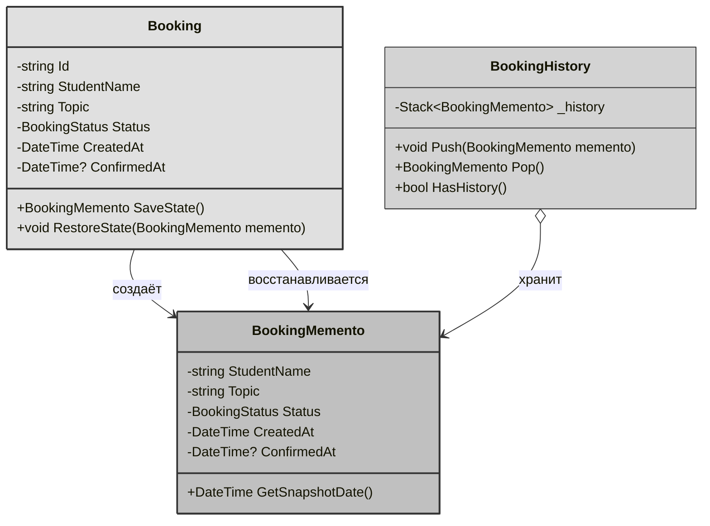
```mermaid
classDiagram
    class Booking {
        -string Id
        -string StudentName
        -string Topic
        -BookingStatus Status
        -DateTime CreatedAt
        -DateTime? ConfirmedAt
        +BookingMemento SaveState()
        +void RestoreState(BookingMemento memento)
    }

    class BookingMemento {
        -string StudentName
        -string Topic
        -BookingStatus Status
        -DateTime CreatedAt
        -DateTime? ConfirmedAt
        +DateTime GetSnapshotDate()
    }

    class BookingHistory {
        -Stack~BookingMemento~ _history
        +void Push(BookingMemento memento)
        +BookingMemento Pop()
        +bool HasHistory()
    }

    Booking --> BookingMemento : создаёт
    Booking --> BookingMemento : восстанавливается
    BookingHistory o--> BookingMemento : хранит

    style Booking fill:#e0e0e0,stroke:#333,stroke-width:2px
    style BookingMemento fill:#c0c0c0,stroke:#333,stroke-width:2px
    style BookingHistory fill:#d3d3d3,stroke:#333,stroke-width:1px
```

#### Фрагмент программного кода

**Класс снимка (Memento):**

```csharp
using ConsultationAPI.Enums;

namespace ConsultationAPI.Memento
{
    // Снимок состояния бронирования
    public class BookingMemento
    {
        // Сохраняем только те поля, которые нужны
        public string StudentName { get; private set; }
        public string Topic { get; private set; }
        public BookingStatus Status { get; private set; }
        public DateTime CreatedAt { get; private set; }
        public DateTime? ConfirmedAt { get; private set; }
        public DateTime? CancelledAt { get; private set; }
        public string? MeetingLink { get; private set; }
        
        // Дата создания снимка (для истории)
        public DateTime SnapshotDate { get; private set; }

        public BookingMemento(
            string studentName, 
            string topic, 
            BookingStatus status, 
            DateTime createdAt,
            DateTime? confirmedAt,
            DateTime? cancelledAt,
            string? meetingLink)
        {
            StudentName = studentName;
            Topic = topic;
            Status = status;
            CreatedAt = createdAt;
            ConfirmedAt = confirmedAt;
            CancelledAt = cancelledAt;
            MeetingLink = meetingLink;
            SnapshotDate = DateTime.UtcNow;
        }
    }
}
```

**Класс бронирования с поддержкой снимков:**

```csharp
using ConsultationAPI.Models;
using ConsultationAPI.Enums;
using ConsultationAPI.Memento;

namespace ConsultationAPI.Models
{
    // Расширяем существующий Booking возможностью сохранения состояния
    public class BookingWithHistory : Booking
    {
        public BookingWithHistory()
        {
            Id = Guid.NewGuid().ToString();
            CreatedAt = DateTime.UtcNow;
            Status = BookingStatus.Pending;
        }

        // Создать снимок текущего состояния
        public BookingMemento SaveState()
        {
            Console.WriteLine($"Создан снимок бронирования {Id} (статус: {Status})");
            
            return new BookingMemento(
                StudentName,
                Topic,
                Status,
                CreatedAt,
                ConfirmedAt,
                CancelledAt,
                MeetingLink
            );
        }

        // Восстановить состояние из снимка
        public void RestoreState(BookingMemento memento)
        {
            StudentName = memento.StudentName;
            Topic = memento.Topic;
            Status = memento.Status;
            CreatedAt = memento.CreatedAt;
            ConfirmedAt = memento.ConfirmedAt;
            CancelledAt = memento.CancelledAt;
            MeetingLink = memento.MeetingLink;
            
            Console.WriteLine($"Восстановлено состояние от {memento.SnapshotDate:HH:mm:ss} (статус: {Status})");
        }

        // Методы для изменения состояния
        public void Confirm(string? meetingLink = null)
        {
            Status = BookingStatus.Confirmed;
            ConfirmedAt = DateTime.UtcNow;
            MeetingLink = meetingLink;
            Console.WriteLine($"Бронирование {Id} подтверждено");
        }

        public void Cancel()
        {
            Status = BookingStatus.Cancelled;
            CancelledAt = DateTime.UtcNow;
            Console.WriteLine($"Бронирование {Id} отменено");
        }

        public void ChangeTopic(string newTopic)
        {
            Topic = newTopic;
            Console.WriteLine($"Тема изменена на: {newTopic}");
        }
    }
}
```

**История изменений (Caretaker):**

```csharp
using ConsultationAPI.Memento;

namespace ConsultationAPI.History
{
    public class BookingHistory
    {
        private readonly Stack<BookingMemento> _history = new Stack<BookingMemento>();
        private readonly Stack<BookingMemento> _redoStack = new Stack<BookingMemento>();

        // Сохранить состояние
        public void Push(BookingMemento memento)
        {
            _history.Push(memento);
            _redoStack.Clear(); // очищаем стек повтора
            Console.WriteLine($"Состояние сохранено. Всего снимков: {_history.Count}");
        }

        // Отменить последнее изменение
        public BookingMemento? Undo()
        {
            if (_history.Count <= 1) // оставляем хотя бы одно состояние
            {
                Console.WriteLine("Нельзя отменить: нет предыдущих состояний");
                return null;
            }

            var current = _history.Pop();
            _redoStack.Push(current);
            var previous = _history.Peek();
            
            Console.WriteLine($"Отмена: возврат к состоянию от {previous.SnapshotDate:HH:mm:ss}");
            return previous;
        }

        // Повторить отменённое действие
        public BookingMemento? Redo()
        {
            if (_redoStack.Count == 0)
            {
                Console.WriteLine("Нечего повторять");
                return null;
            }

            var redoState = _redoStack.Pop();
            _history.Push(redoState);
            
            Console.WriteLine($"Повтор: состояние от {redoState.SnapshotDate:HH:mm:ss}");
            return redoState;
        }

        // Получить текущее состояние (последний снимок)
        public BookingMemento? GetCurrent()
        {
            return _history.Count > 0 ? _history.Peek() : null;
        }

        // Получить всю историю
        public List<BookingMemento> GetHistory()
        {
            return _history.Reverse().ToList();
        }

        public bool HasHistory => _history.Count > 0;
    }
}
```
## Шаблоны проектирования GoF (продолжение)

### Поведенческие шаблоны

---

### 13. State (Состояние)

#### Общее назначение
State — это поведенческий паттерн, который позволяет объекту менять поведение в зависимости от своего состояния. Со стороны кажется, что объект меняет свой класс. Паттерн выделяет состояния в отдельные классы и делегирует им выполнение действий.

#### Назначение в проекте
В системе бронирование (`Booking`) может находиться в разных состояниях:
- `Pending` (ожидает подтверждения)
- `Confirmed` (подтверждено)
- `Cancelled` (отменено)
- `Completed` (завершено)

В каждом состоянии доступны разные действия. Например, подтвердить можно только ожидающее бронирование, отменить можно ожидающее или подтверждённое, завершить — только подтверждённое. Вместо множества проверок `if (status == ...)` используем паттерн State.

#### UML-диаграмма

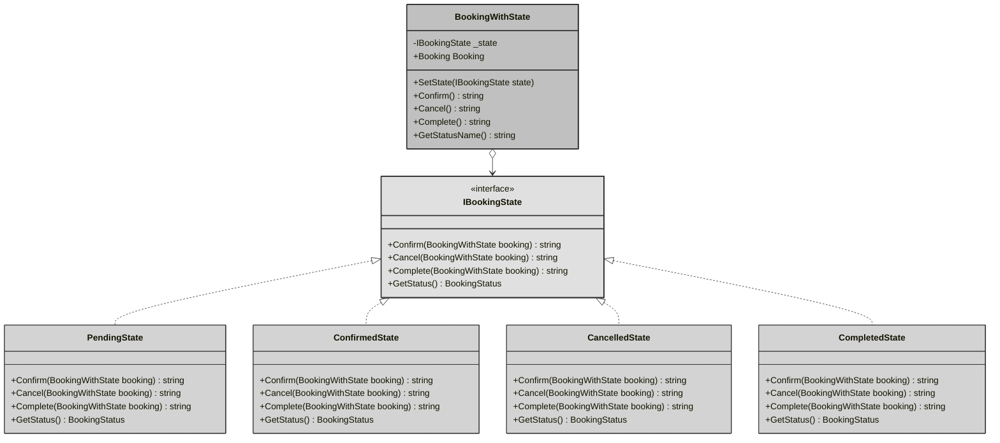
```mermaid
classDiagram
    class BookingWithState {
        -IBookingState _state
        +Booking Booking
        +SetState(IBookingState state)
        +Confirm() string
        +Cancel() string
        +Complete() string
        +GetStatusName() string
    }

    class IBookingState {
        <<interface>>
        +Confirm(BookingWithState booking) string
        +Cancel(BookingWithState booking) string
        +Complete(BookingWithState booking) string
        +GetStatus() BookingStatus
    }

    class PendingState {
        +Confirm(BookingWithState booking) string
        +Cancel(BookingWithState booking) string
        +Complete(BookingWithState booking) string
        +GetStatus() BookingStatus
    }

    class ConfirmedState {
        +Confirm(BookingWithState booking) string
        +Cancel(BookingWithState booking) string
        +Complete(BookingWithState booking) string
        +GetStatus() BookingStatus
    }

    class CancelledState {
        +Confirm(BookingWithState booking) string
        +Cancel(BookingWithState booking) string
        +Complete(BookingWithState booking) string
        +GetStatus() BookingStatus
    }

    class CompletedState {
        +Confirm(BookingWithState booking) string
        +Cancel(BookingWithState booking) string
        +Complete(BookingWithState booking) string
        +GetStatus() BookingStatus
    }

    BookingWithState o--> IBookingState
    IBookingState <|.. PendingState
    IBookingState <|.. ConfirmedState
    IBookingState <|.. CancelledState
    IBookingState <|.. CompletedState

    style IBookingState fill:#e0e0e0,stroke:#333,stroke-width:2px
    style BookingWithState fill:#c0c0c0,stroke:#333,stroke-width:2px
    style PendingState fill:#d3d3d3,stroke:#333,stroke-width:1px
    style ConfirmedState fill:#d3d3d3,stroke:#333,stroke-width:1px
    style CancelledState fill:#d3d3d3,stroke:#333,stroke-width:1px
    style CompletedState fill:#d3d3d3,stroke:#333,stroke-width:1px
```

#### Фрагмент программного кода

**Интерфейс состояния и класс-обёртка:**

```csharp
using ConsultationAPI.Enums;

namespace ConsultationAPI.Models
{
    // Интерфейс состояния
    public interface IBookingState
    {
        string Confirm(BookingWithState booking);
        string Cancel(BookingWithState booking);
        string Complete(BookingWithState booking);
        BookingStatus GetStatus();
    }

    // Класс-обёртка для Booking с поддержкой состояний
    public class BookingWithState
    {
        private IBookingState _state;
        public Booking Booking { get; private set; }

        public BookingWithState(Booking booking)
        {
            Booking = booking;
            
            // Устанавливаем состояние на основе текущего статуса
            _state = booking.Status switch
            {
                BookingStatus.Pending => new PendingState(),
                BookingStatus.Confirmed => new ConfirmedState(),
                BookingStatus.Cancelled => new CancelledState(),
                BookingStatus.Completed => new CompletedState(),
                _ => new PendingState()
            };
        }

        public void SetState(IBookingState state)
        {
            _state = state;
            Booking.Status = _state.GetStatus();
        }

        public string Confirm()
        {
            var result = _state.Confirm(this);
            Booking.Status = _state.GetStatus();
            return result;
        }

        public string Cancel()
        {
            var result = _state.Cancel(this);
            Booking.Status = _state.GetStatus();
            return result;
        }

        public string Complete()
        {
            var result = _state.Complete(this);
            Booking.Status = _state.GetStatus();
            return result;
        }

        public string GetStatusName() => _state.GetStatus().ToString();
    }
}
```

**Конкретные состояния:**

```csharp
namespace ConsultationAPI.Models
{
    // Состояние: Ожидание
    public class PendingState : IBookingState
    {
        public string Confirm(BookingWithState booking)
        {
            booking.SetState(new ConfirmedState());
            booking.Booking.ConfirmedAt = DateTime.UtcNow;
            return "✅ Бронирование подтверждено";
        }

        public string Cancel(BookingWithState booking)
        {
            booking.SetState(new CancelledState());
            booking.Booking.CancelledAt = DateTime.UtcNow;
            return "❌ Бронирование отменено";
        }

        public string Complete(BookingWithState booking)
        {
            return "⚠️ Нельзя завершить неподтверждённое бронирование";
        }

        public BookingStatus GetStatus() => BookingStatus.Pending;
    }

    // Состояние: Подтверждено
    public class ConfirmedState : IBookingState
    {
        public string Confirm(BookingWithState booking)
        {
            return "⚠️ Бронирование уже подтверждено";
        }

        public string Cancel(BookingWithState booking)
        {
            booking.SetState(new CancelledState());
            booking.Booking.CancelledAt = DateTime.UtcNow;
            return "❌ Бронирование отменено";
        }

        public string Complete(BookingWithState booking)
        {
            booking.SetState(new CompletedState());
            return "✅ Консультация проведена";
        }

        public BookingStatus GetStatus() => BookingStatus.Confirmed;
    }

    // Состояние: Отменено
    public class CancelledState : IBookingState
    {
        public string Confirm(BookingWithState booking)
        {
            return "⚠️ Нельзя подтвердить отменённое бронирование";
        }

        public string Cancel(BookingWithState booking)
        {
            return "⚠️ Бронирование уже отменено";
        }

        public string Complete(BookingWithState booking)
        {
            return "⚠️ Нельзя завершить отменённое бронирование";
        }

        public BookingStatus GetStatus() => BookingStatus.Cancelled;
    }

    // Состояние: Завершено
    public class CompletedState : IBookingState
    {
        public string Confirm(BookingWithState booking)
        {
            return "⚠️ Нельзя подтвердить завершённое бронирование";
        }

        public string Cancel(BookingWithState booking)
        {
            return "⚠️ Нельзя отменить завершённое бронирование";
        }

        public string Complete(BookingWithState booking)
        {
            return "⚠️ Бронирование уже завершено";
        }

        public BookingStatus GetStatus() => BookingStatus.Completed;
    }
}
```

#### Диаграмма переходов состояний

```
                     ┌─────────────┐
                     │   Pending   │
                     └──────┬──────┘
                            │
                ┌───────────┴───────────┐
                │ confirm    │ cancel   │
                ↓            ↓           │
          ┌───────────┐  ┌───────────┐  │
          │ Confirmed │  │ Cancelled │  │
          └─────┬─────┘  └───────────┘  │
                │            │           │
                │ complete   │           │
                ↓            │           │
          ┌───────────┐      │           │
          │ Completed │      │           │
          └───────────┘      │           │
                              │           │
                              └───────────┘
```
